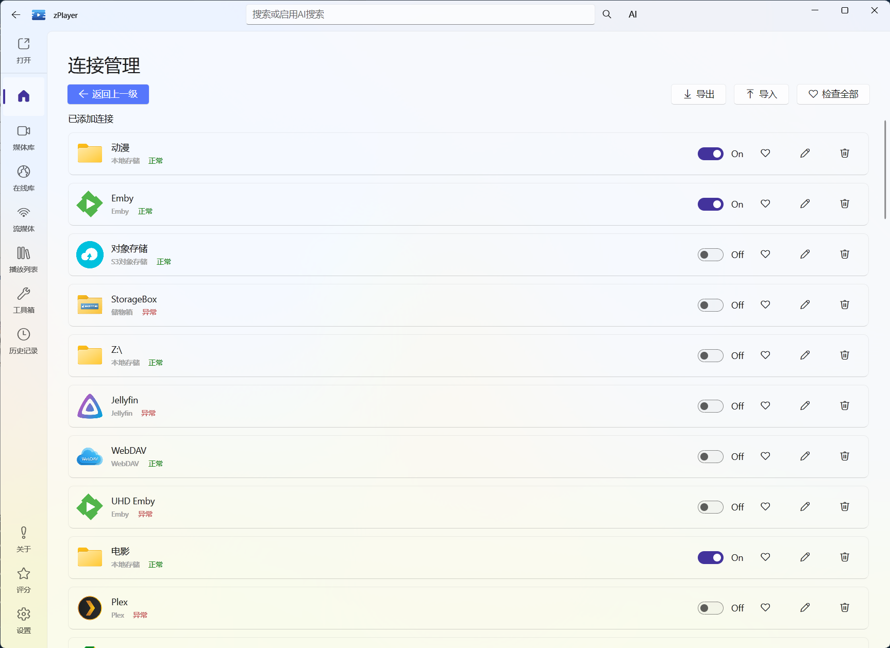
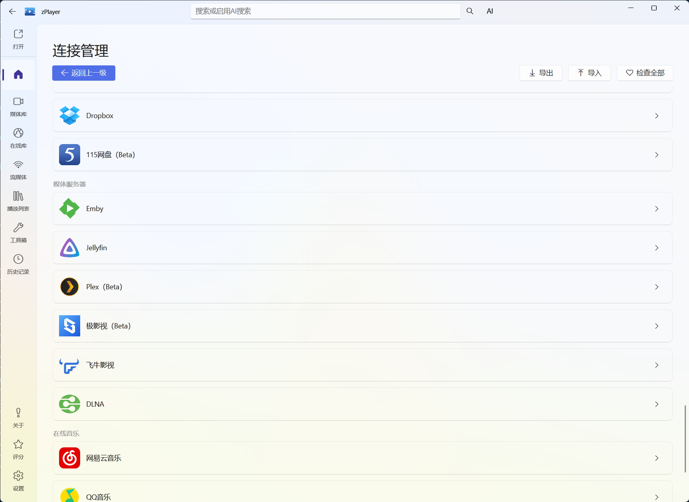
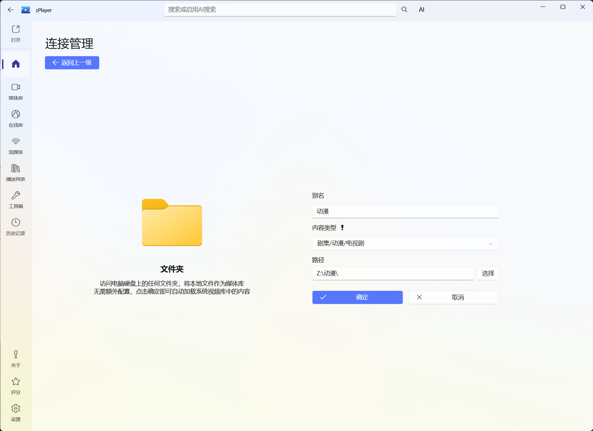
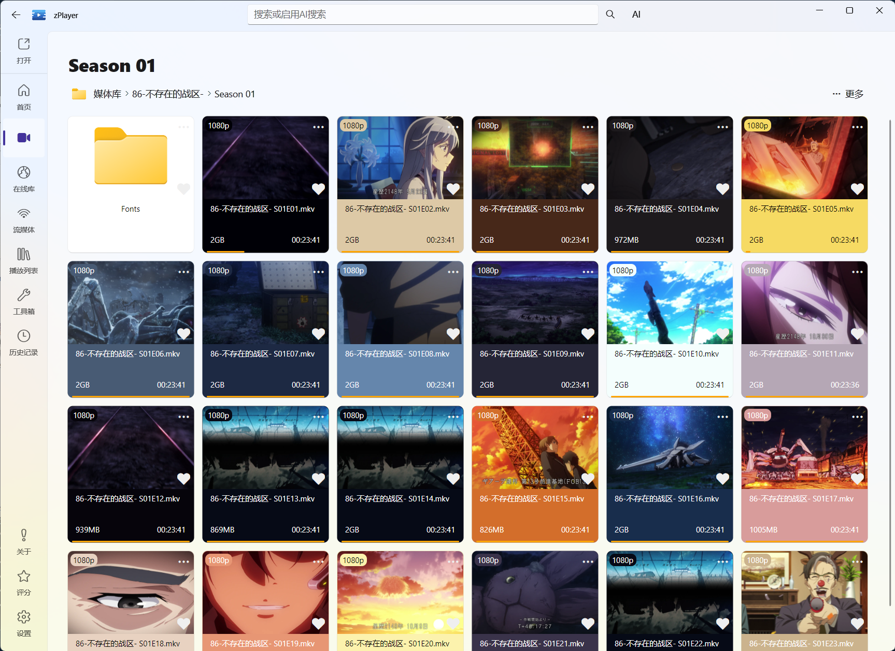

# 文件服务：先把媒体接进来

文件服务解决的是一个很实际的问题：**你的电影、电视剧和音乐到底放在哪里？**

电脑硬盘、NAS、网盘和媒体服务器都可以从“连接管理”添加。不同服务的填写项各不相同，但真正容易出错的地方只有一个——**内容类型要选对**。

## 所有连接都走这条流程

无论添加的是本地目录、NAS 还是媒体服务器，基本步骤都是：

> **连接管理 → 选择分类 → 选择服务 → 填写连接信息 → 保存 → 回到首页自动刷新**

“连接管理”可以从“媒体库”页面进入，首页也有同名入口。保存后回到首页，zPlayer 会自动刷新刚添加的来源。


<p class="zplayer-screenshot-caption">图：连接管理集中显示来源状态，并提供启用、编辑、收藏和删除入口。</p>

服务需要填写哪些地址、账户、密码、路径或授权信息，由具体服务决定；照着当前页面的字段填写即可。本页先讲选择逻辑和容易踩坑的地方。


<p class="zplayer-screenshot-caption">图：添加连接按本地媒体、网络文件服务、云盘与对象存储、媒体服务器等类别组织；先选类别，再选择具体服务。</p>

## 先分清两个“分类”

连接管理里会先按来源把服务分组，例如“本地媒体”“网络文件服务”“媒体服务器”。选定服务后，部分来源还会出现一个“内容类型”选项。

这两个概念不是一回事：

- **来源分类**：帮助你找到要添加的服务。
- **内容类型**：告诉首页管理应该把这批内容按什么方式交给 TMDB 刮削。

下面说的“电影 / 电视剧 / 音乐”，指的是第二个“内容类型”。它会直接影响首页刮削结果。

## 内容类型一定要选准确

对于非媒体服务器来源，zPlayer 需要你主动选择内容类型。请按这个连接对应的目录实际内容来选：


<p class="zplayer-screenshot-caption">图：文件夹连接的表单会让你填写别名、内容类型和路径；这里的“内容类型”会直接影响后续刮削。</p>

| 目录里的内容 | 内容类型 | 适合的添加方式 |
| --- | --- | --- |
| 一整个目录都是电影 | 电影 | 单独添加电影目录 |
| 一整个目录都是电视剧 | 电视剧 | 单独添加电视剧目录 |
| 一整个目录都是音乐 | 音乐 | 添加音乐目录或在线音乐来源 |
| 不想参与首页刮削的内容 | 无 | 只用于目录浏览或临时访问 |

例如，你的 NAS 上如果是下面这样：

```text
媒体/
├─ 电影/       ← 作为一个连接，内容类型选“电影”
├─ 电视剧/     ← 作为一个连接，内容类型选“电视剧”
└─ 音乐/       ← 作为一个连接，内容类型选“音乐”
```

就分别添加这三个目录。**不要把“媒体”这个公共根目录直接加入连接管理。**根目录里混有电影、电视剧甚至音乐时，zPlayer 无法用一个内容类型准确描述它，TMDB 刮削很容易匹配错误。

::: warning 刮削不准确，先检查这里
如果海报、标题或剧集信息明显不对，先不要急着换刮削源。检查连接对应的目录是否内容混杂，以及“内容类型”是否选错，通常更容易找到原因。
:::

文件服务的另一个好处是保留了原来的目录层级。你可以先进入剧集目录，再进入季目录，最后从具体视频文件播放；这适合只想按文件结构找片的场景。


<p class="zplayer-screenshot-caption">图：进入季目录后，文件服务会把视频文件、分辨率、大小、时长和观看进度放在一起显示。</p>

### 在线音乐是特殊情况

网易云音乐、QQ 音乐等在线音乐来源会强制使用“音乐”内容类型，不能修改。这是因为它们本身就是音乐来源，不参与电影或电视剧的 TMDB 刮削流程。登录和播放方式见[音乐播放器](/docs/player/music)。

## 连接管理中的来源分类

连接管理按下面这些分组组织服务；同一分组里的服务用途相近，但具体字段会随服务类型而不同。

| 来源分类 | 常见服务 | 适合什么情况 |
| --- | --- | --- |
| **本地媒体** | 本地磁盘、视频库、音乐库、图片库、存储箱 | 媒体就在这台 Windows 电脑或已挂载的磁盘上。 |
| **网络文件服务** | FTP、SFTP、SMB、WebDAV、AList、OpenList | 媒体放在 NAS、局域网共享或远程文件目录中。 |
| **云盘与对象存储** | S3、Google Drive、OneDrive、Dropbox 等 | 媒体放在云端或对象存储中。115 网盘连接暂不可用，见下文。 |
| **媒体服务器** | Emby、Jellyfin、Plex、极影视、飞牛影视、DLNA 等 | 服务端已经提供了媒体库、媒体信息或播放入口。 |
| **在线音乐** | 网易云音乐、QQ 音乐 | 浏览和播放在线音乐歌单。 |
| **在线与下载** | 磁力链接、BT 种子、YouTube 等 | 添加在线地址、下载任务或临时来源。 |

常见媒体服务器：

| Emby | Jellyfin | Plex | 飞牛影视 |
| --- | --- | --- | --- |
|  |  |  |  |

## 媒体服务器：先理解两种模式

添加 Emby、Jellyfin、Plex、极影视或飞牛影视时，部分服务会提供“媒体库模式”开关。它和普通目录连接的思路不一样。

媒体服务器不需要你再手动选择“电影”或“电视剧”。它会根据服务器返回的媒体库和内容信息决定如何展示；不要为了配合服务器再额外套一个本地目录的内容类型。

### 媒体库模式

开启后，zPlayer 会获取媒体服务器返回的全部媒体信息，把服务器中的媒体作为一个完整片库参与首页管理，再和其他来源一起组织。这种行为可以理解为类似 Infuse 的媒体库模式：软件会主动读取整个服务器媒体库，而不只是打开你手动点到的目录。

媒体库模式适合**自建、自己管理的媒体服务器**。服务器内容越多，需要读取和整理的信息也越多，首次加载可能需要更长时间。

### 直连模式

直连模式更适合只想浏览服务器目录、按需打开内容的场景。对于别人提供给你的共享服务器、公共服务器或非自建服务器，通常建议使用直连模式，不要开启媒体库模式。

::: warning 非自建媒体服务器不要轻易开启媒体库模式
媒体库模式会请求服务器中的全部媒体信息。对非自建服务器来说，这不仅可能导致刮削和加载很慢，还容易触发服务端限制，甚至有封号风险。除非你明确知道服务器管理员允许这样做，否则请选择直连模式。
:::

可以简单记成：

- 自己搭建并管理的服务器：需要完整片库时，再考虑开启媒体库模式。
- 他人共享或非自建服务器：优先直连模式。
- 不确定时：先用直连模式，确认能正常浏览和播放后再决定。

## 两个需要特别注意的来源

### 飞牛影视端口是 8005

飞牛影视的连接地址默认端口是 **8005**，不是 5666。填写地址时可以参考：

```text
http://你的飞牛地址:8005
```

如果把端口写成 5666，通常会表现为无法连接或连接超时；如果你在飞牛端手动修改过端口，则以实际端口为准。

### 115 网盘连接暂不可用

115 网盘已关闭开发者入驻，因此 zPlayer 的 115 网盘连接暂不可用。是否恢复取决于服务开放情况；不建议为了这个入口反复修改其他网盘配置。

## 添加后怎么确认成功

保存后回到首页，等待自动刷新，然后检查三件事：

1. 首页或媒体库中出现了刚才设置的来源名称。
2. 打开来源后，能看到预期的目录或媒体库。
3. 随便打开一个文件或媒体，确认能进入播放器。

如果能浏览但首页海报不对，优先回到“内容类型”和目录结构检查；如果来源完全没有出现，再检查服务地址、账户权限、网络和具体服务是否在线。

接下来可以继续阅读[首页管理](/docs/media/home-management)，了解如何在连接正确之后进行扫描、刮削和整理。
