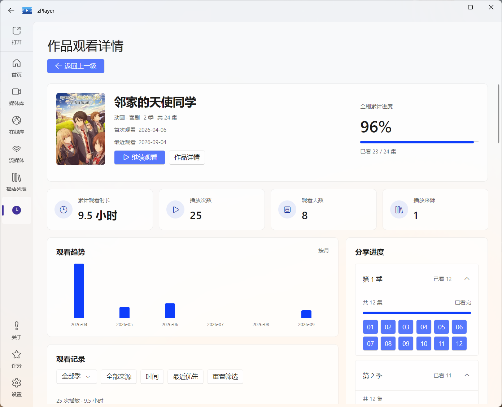

# 作品观看详情：查看一部作品的完整历程

作品观看详情是一个独立页面，把同一部作品的多次播放、不同季度和已确认的不同来源放在一起。这里既能查看累计数据，也能展开到某一天、某一集、某一次播放。

图：围绕一部作品查看累计观看数据、观看趋势与分季进度。点击截图可查看大图。

## 从哪里进入

| 入口 | 操作 |
| --- | --- |
| 历史记录 | 把鼠标移到作品或文件卡片上，点击“查看全部历史” |
| 媒体详情 | 点击“观看历史”；没有对应记录时显示“暂无观看记录” |
| 播放统计 | 点击作品排行中的一部作品 |
| 观看回顾 | 点击片单中的作品，或观看节点上的记录入口 |

“查看全部历史”会打开这张作品观看详情页。它可以展示作品总览、趋势和分季进度，不局限于历史首页的时间列表。

## 作品总览

页面上方展示海报、作品名、首次与最近观看时间，以及整剧累计进度或媒体观看进度。四张数据卡片分别显示：

- **累计观看时长**：这部作品所有保留记录的观看时长之和；
- **播放次数**：所有保留记录中的播放次数；
- **观看天数**：观看这部作品的不同日期数量；
- **播放来源**：这部作品历史中不同来源的数量。

电视剧按已看集数展示全剧进度。同一集多次播放或跨来源重看不会重复增加已看集数。只有能够确认属于同一作品的记录才会汇总，剧名相同本身不是合并依据。

字段的统计方式与[播放统计口径](/docs/media/history/playback-statistics#counting-rules)一致。

## 观看趋势、来源和分季进度

观看趋势按月份展示这部作品的观看时长，来源栏目展示不同来源的观看分布。点击其中一项，可以定位到对应范围的观看记录。

电视剧还会显示分季进度：展开“第 X 季”，查看这一季的剧集与观看状态；点击具体集数可以筛选到该集的播放记录。季总集数已知且全部看完时，页面会显示这一季的完成状态和完成日期。

缺少可靠总集数时，不会把首页恰好缓存的几集当成整季或整部剧的总数。元数据补齐后，已有历史会参与重新计算。

## 查看和筛选观看记录

“观看记录”按日期组织，剧集条目保留缩略图、季集编号、剧集名和原文件名。展开条目可查看每次播放的开始、结束、时长及结束位置，并删除某一次播放。

可以按季度、来源、时间或某一集缩小记录范围。从统计或回顾进入时，页面会带入相应的记录条件，并显示可移除的筛选标签；清除条件后，可以重新查看这部作品的全部记录。

**这些条件只影响下方的观看记录。** 上方累计数据、全剧进度和分季概览仍展示整部作品的完整历程，因此可能大于当前筛选记录的合计值。

鼠标移到剧集缩略图上，可以播放这条历史原本对应的文件。删除某一次播放只移除该次记录，其余日期和次数保留；删除范围和远端边界见[历史记录](/docs/media/history#deleting-history)。

## 继续观看与媒体详情

“继续观看”会从这部作品最近的播放记录继续；如果最近一集已看完，而且已有资料中能找到下一集，会优先衔接下一集。来源不可用或文件已经移动时，需要先恢复对应文件或连接。

“作品详情”用于进入媒体详情页，查看简介、演职人员、季度和可用片源。能否使用这个入口取决于是否能够找到对应的媒体资料；普通视频仍可以查看自己的观看记录，不需要先识别成电影或电视剧。

媒体详情里的“观看历史”可以回到这里。在这两个页面之间往返时，会优先返回已经打开的对应页面，保留原来的浏览上下文，避免不断增加重复的返回层级。

## 本地来源为什么会显示“动漫”

从资源管理器直接打开的文件，如果完整路径明确匹配到名为“动漫”的本地媒体库，观看记录、来源数量和来源筛选都会使用“动漫”。从这条历史进入作品详情时，也会优先使用它所属的媒体库。

这只是把观看记录与已知作品关联起来，原文件和每次播放记录仍保留自己的操作目标。同一文件属于多个媒体库或匹配不明确时，不会随意替用户选择来源，详见[作品与来源归属](/docs/media/history#work-and-source)。
