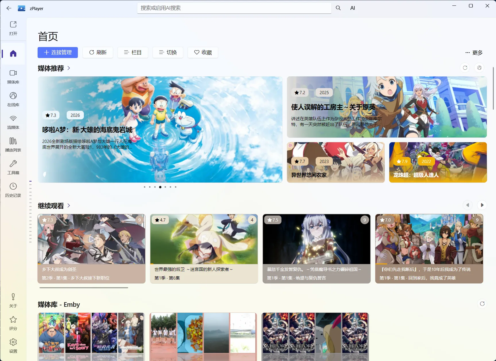
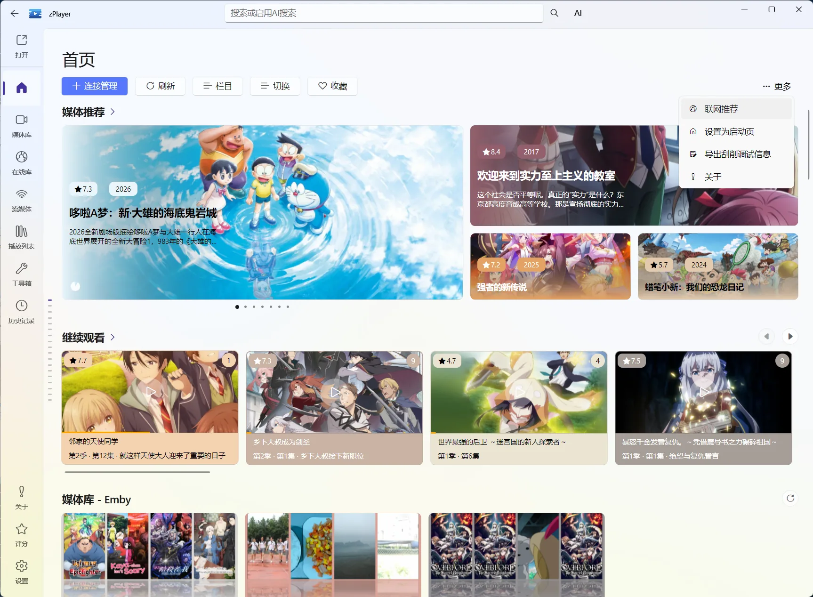

# 首页管理：把媒体整理成真正想看的首页

如果只是临时打开一个视频，文件服务甚至不是必需的——使用左上角的“打开 → 文件”就能播放；在 Windows 11 中把对应格式的默认应用设为 zPlayer 后，也可以从资源管理器双击。

但当你有一批电影、电视剧，或者同一套媒体同时来自本地、NAS、Emby、Jellyfin、Plex 时，单纯按文件夹找片会很快变得混乱。首页管理就是为这个场景准备的：zPlayer 会把来源中的媒体识别出来，补齐海报、评分、剧情、演员和剧集信息，再用海报墙和栏目呈现出来。

图：首页把推荐、继续观看和不同媒体来源组织成可滚动的栏目。

## 首页管理到底负责什么

可以把 zPlayer 的媒体流程理解成三层：

| 层级 | 负责的事情 | 你会在哪里操作 |
| --- | --- | --- |
| 文件服务 | 连接本地目录、NAS、网盘或媒体服务器，让软件找到文件 | [文件服务](/docs/media/file-services) |
| 首页管理 | 扫描、刮削、分类、搜索，并把内容组织成栏目 | 首页管理 |
| 媒体详情 | 查看一部作品的资料、剧集、版本和片源，并执行播放、收藏等操作 | [媒体详情](/docs/media/home/media-detail) |

首页不是一个需要你每天手动维护的“数据库后台”。来源发生变化后，首页会自动刷新并处理新增、删除或变更的媒体，通常不需要你再点一次刷新。

## 第一次配置建议这样走

1. 打开[文件服务](/docs/media/file-services)，添加真正存放媒体的目录或服务。
2. 保存来源后回到首页，等待它自动刷新和刮削。首次内容较多时，给它一点时间。
3. 随便打开一部电影和一部电视剧，检查标题、海报、年份、剧集和片源是否对应。
4. 如果匹配正确，再按自己的习惯调整首页栏目；如果本地有较完整的电影、电视剧目录，建议把首页设置为启动页。
5. 以后新增或移除来源，保存后回到首页即可；不需要养成手动刷新首页的习惯。

::: tip 只想播放一个文件？
使用左上角的“打开 → 文件”更快；设置好 Windows 默认应用后也可双击文件。连接管理更适合长期使用：它能让目录持续出现在首页，并参与搜索、刮削、收藏和继续观看。
:::

## 首页上方的几个入口

### 连接管理

从这里添加、编辑或删除来源。来源保存后，首页会自动刷新，因此“连接管理”是首页内容的入口，不是一次性的导入工具。

### 刷新

这是给需要主动处理的情况准备的：

- **仅刷新新增或删除的媒体**：检查来源的变化，适合日常补充内容。
- **重新刮削刷新全部媒体**：让全部媒体重新匹配和获取元数据，适合更换刮削设置或需要整体修复时使用。
- **停止当前刷新**：来源较多、网络较慢时，可以停止正在进行的任务。

正常增删改来源后不需要手动点这里；只有你希望立刻进行一次指定范围的刷新时才使用它。

### 栏目

进入“栏目管理”，可以调整首页现有栏目和来源栏目的显示状态、顺序，还能新建自定义动态栏目。它是首页最值得花时间配置的功能，详见[首页栏目与布局](/docs/media/home/layout)和[动态栏目：按条件生成你的首页](/docs/media/home/layout#dynamic-columns)。

### 收藏

直接进入收藏内容。想长期保留某部作品时用收藏；想按主题整理一组片子时，使用片单会更合适，区别见[收藏、观看状态与继续观看](/docs/media/home/favorites-and-history)和[片单](/docs/media/home/playlists)。

### 右上角“更多”

这里有联网推荐、设置为启动页和导出刮削调试信息等入口。遇到刮削错误时，最重要的是“导出刮削调试信息”，具体反馈方式见[日志导出与反馈](/docs/troubleshooting/logs-and-feedback)。

图：首页的“更多”菜单集中放置联网推荐、启动页和刮削信息导出等不常用但很重要的入口。

## 首页内容不对时，先别急着全库重刮

一部作品匹配错误，往往只是同名作品太多、目录类型选错，或文件命名不足以让 TMDB 判断。建议按下面的顺序处理：

1. 打开错误媒体的[媒体详情](/docs/media/home/media-detail)。
2. 先尝试“重新刮削”，搜索后从 TMDB 结果中选中正确的作品。
3. 如果作品已经匹配正确，只是标题、海报、简介或剧集信息不理想，使用“编辑元数据”。
4. 如果多个媒体都异常，再检查[扫描与刮削](/docs/media/home/scraping)中的来源分类、目录结构和网络设置。
5. 仍然无法判断时，从首页右上角“更多”中选择“导出刮削调试信息”，把导出的文件通过开发者邮箱反馈，便于定位具体来源和匹配过程。

## 按需求继续查看

| 你想做什么 | 对应页面 |
| --- | --- |
| 调整首页显示哪些内容、栏目顺序 | [首页栏目与布局](/docs/media/home/layout) |
| 理解自动刷新、重新刮削和错误反馈 | [扫描与刮削](/docs/media/home/scraping) |
| 修正 TMDB 匹配或手动编辑资料 | [TMDB 与元数据](/docs/media/home/metadata) |
| 搜索、筛选和查看联网推荐 | [搜索、分类与推荐](/docs/media/home/search-and-recommendation) |
| 查看一部电影或电视剧的完整信息 | [媒体详情](/docs/media/home/media-detail) |
| 按日期查看播放记录、分组、排序和统计 | [历史记录](/docs/media/history) |
| 管理收藏、观看状态和继续观看 | [收藏、观看状态与继续观看](/docs/media/home/favorites-and-history) |
| 按主题整理一组固定内容 | [片单](/docs/media/home/playlists) |
