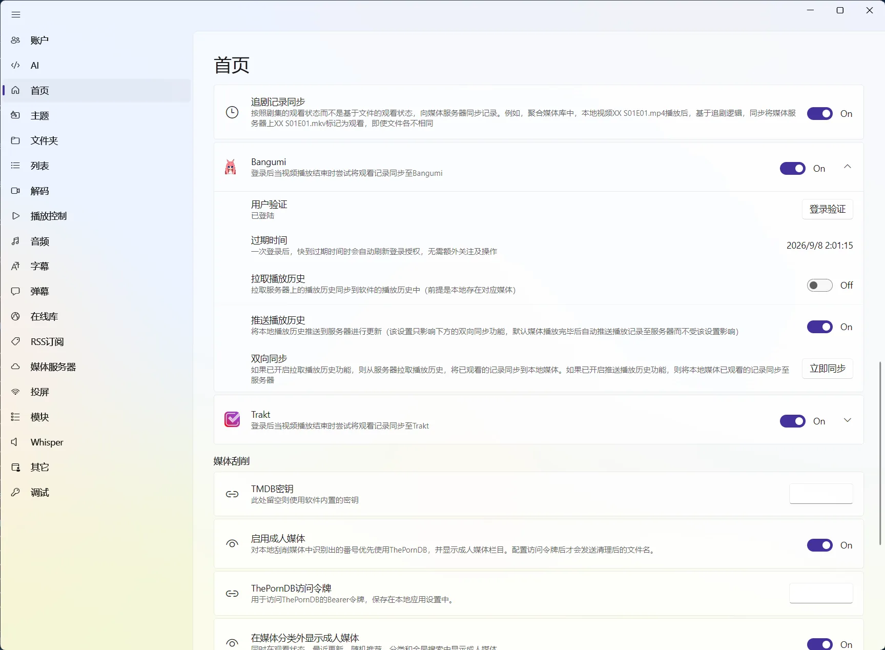

# 收藏、观看状态与继续观看

首页会利用播放记录和媒体信息展示“继续观看”、未观看状态、收藏与动态栏目，但它不负责呈现完整的时间列表。想按日期查看真正播放过的内容或切换分组，请进入独立的[历史记录](/docs/media/history)模块；想分析观看时长、活动分布和常看来源，请查看[播放统计](/docs/media/history/playback-statistics)。

## 先分清历史记录、播放进度和已观看

这三个概念经常一起出现，但用途并不相同：

| 内容 | 它回答的问题 | 典型使用场景 |
| --- | --- | --- |
| [历史记录](/docs/media/history) | 我最近播放过什么？ | 按时间找回播放过的电影、剧集或音乐 |
| 播放进度 | 我看到哪一秒？ | 从上次停止的位置继续播放 |
| 已观看状态 | 这部内容我看完了吗？ | 在首页筛选未观看、观看中和已观看 |
| 收藏 | 我想长期保留哪些作品？ | 从首页收藏入口快速找回喜欢的内容 |

打开媒体详情页不会自动产生观看记录；通常需要真正开始播放，zPlayer 才会把这次播放纳入记录。

## 继续观看

这是打开软件后最快回到剧情的入口。“继续观看”是首页中最适合放在前排的栏目，它聚合尚未完成的电影、剧集或单集，点击卡片即可回到上次进度。

电视剧会按具体季集保存进度。看完第一季的一集，不会自动把第二季或整部剧标记为已观看；如果只是打开了详情页，也不会因为浏览过资料就被算作看完。

如果同一部媒体来自多个来源，继续观看时会优先使用仍然可访问的来源。原文件被移动、来源被删除或服务器暂时离线时，可以从媒体详情切换到其他可用版本。

## 首页如何使用观看状态

建议把“继续观看”放在首页前排，把独立的[历史记录](/docs/media/history)当作按时间查找入口，把收藏和片单用于更稳定的内容整理。某个栏目不常用时，可以在[首页栏目与布局](/docs/media/home/layout)中关闭，而不是让它一直占据首页空间。

如果你想要一个会自动变化的“最近看过”“正在追”“高分且未观看”栏目，不需要手动维护片单，直接用[动态栏目](/docs/media/home/layout#dynamic-columns)按观看状态、来源、评分或更新时间筛选即可。

## 播放进度与媒体服务器同步

播放本地文件时，进度只保存在 zPlayer 本地；播放 Emby、Jellyfin、Plex、飞牛影视等媒体服务器来源时，zPlayer 还会尝试把当前播放状态和进度回传到服务器。这是播放过程中的自动上报，不需要在播放器里另外点击“同步”。

但“进度上报”和“服务器历史导入”是两件事：

- **直连模式**可以在播放时上报进度，但不会把服务器全部历史和收藏导入首页；
- **媒体库模式**会读取服务器媒体信息，并在刷新时尝试合并服务器历史和收藏；
- 服务器账户需要有更新播放状态的权限，否则可能出现能播放、但服务器没有进度的情况。

完整的服务器行为、媒体库模式和排查顺序见[媒体服务器播放进度同步](/docs/sync/media-server)。

## 同步到 Bangumi 或 Trakt

如果你希望把“看过哪些作品”同步到外部账户，可以在 `设置 → 首页 → 历史记录` 中配置 Bangumi 或 Trakt。它们同步的是观看记录和已看状态，不是 zPlayer 的精确续播秒数。

图：Bangumi 与 Trakt 的授权、拉取和推送开关都集中在首页设置的历史记录区域。

第一次配置建议只打开一个服务，并先用一部已经正确匹配 TMDB 的作品测试。需要了解授权、拉取、推送和匹配规则时，查看[Bangumi 与 Trakt](/docs/sync/bangumi-and-trakt)。

## 收藏、片单和动态栏目怎么选

| 需求 | 用什么 |
| --- | --- |
| 我最近看过什么，想再找回来 | 历史记录 |
| 我只想接着上次没看完的内容 | 继续观看 |
| 我喜欢这部作品，之后还想找得到 | 收藏 |
| 我准备安排一组固定的观看内容 | 普通片单 |
| 我想让“高分且未观看”自动变化 | 动态栏目 |

收藏是稳定的个人标记，不等于已经看过，也不等于马上要看；片单适合手动安排主题，动态栏目适合交给条件自动更新。

## 来源变化后进度没有接上

来源被编辑、删除或重新添加后，首页会自动刷新；如果媒体路径、标识、季集或服务器返回的信息发生变化，旧记录和新来源可能需要在媒体详情中重新确认。

遇到进度没有接上时，按这个顺序检查：

1. 打开的是同一部作品，而不是同名的另一个 TMDB 条目；
2. 当前使用的季集和片源没有变化；
3. 来源连接仍然有效，媒体服务器账户有写入进度的权限；
4. 播放确实开始过，并且已经产生了播放记录；
5. 如果是 Bangumi 或 Trakt，再检查授权状态和匹配信息。

如果只是某一部作品异常，先从[媒体详情](/docs/media/home/media-detail)修正匹配或来源；如果是服务器同步问题，再看[同步异常排查](/docs/sync/troubleshooting)。
