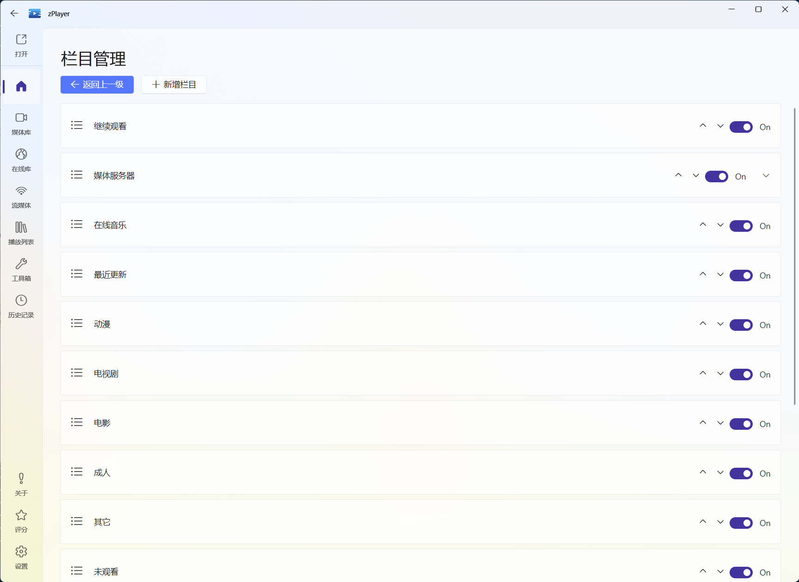
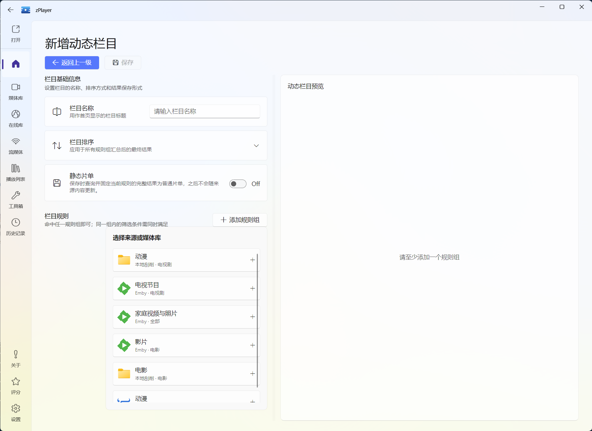
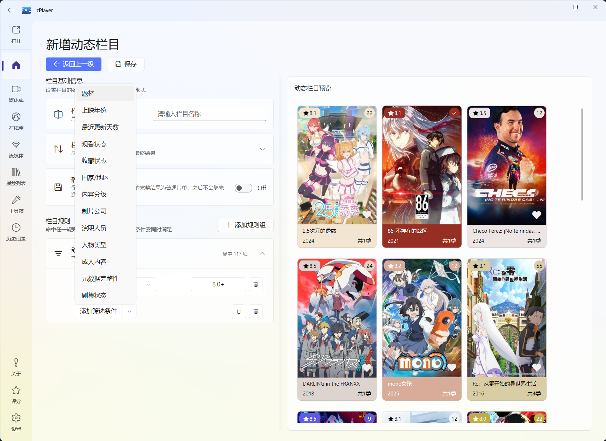
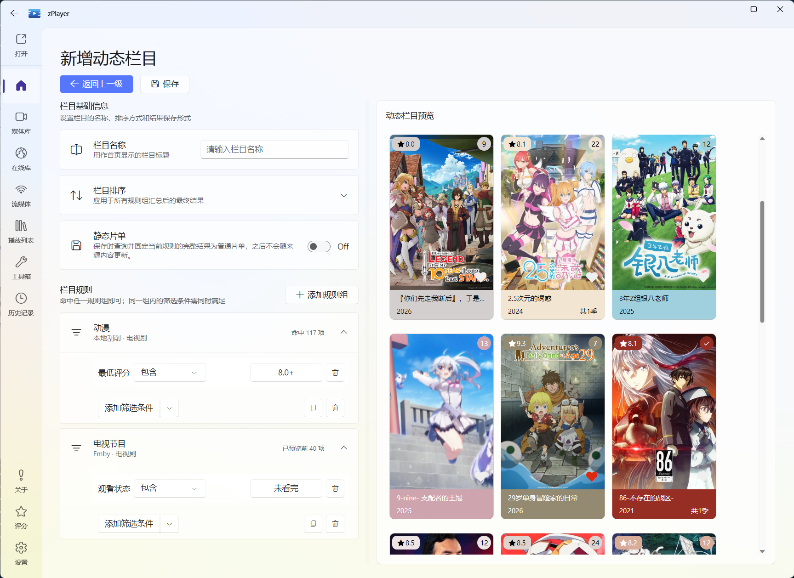

# 首页栏目与布局

首页的核心不是“所有媒体都堆在一页”，而是让你打开软件就能看到下一步想做的事：继续看上次的剧、找到最近加入的电影，或者从一个自己定义的主题栏目里挑片。

## 先认识首页的两种栏目

### 软件自带栏目

这些栏目由播放记录、媒体类型、来源或片单等数据产生，常见的有：

- **继续观看**：从上次的进度继续播放。
- **最近更新**：查看最近加入或最近发生变化的媒体。
- **电影、电视剧、动漫等分类**：按媒体类型浏览。
- **未观看、已观看**：按观看状态找内容。
- **来源或媒体库**：按某个文件服务、媒体服务器或服务器媒体库浏览。
- **收藏、片单、推荐**：集中查看你保留或想发现的内容。

具体显示哪些栏目，会随已配置来源、播放记录和媒体数据变化。没有内容的栏目可能不会显示，或者会显示为空，这是数据条件不满足，不代表刮削失败。

### 自定义动态栏目

这是首页管理里比较特别的一项能力。你可以指定数据来源，再用题材、评分、观看状态、分辨率、动态范围等条件筛选，zPlayer 会把符合条件的媒体组成一个新栏目并固定在首页。

例如：

- “8 分以上且未看完”：只留高分、还没看完的作品。
- “最近 30 天更新”：追新剧时不用在整个首页里翻找。
- “4K HDR 且未看完”：专门留给大屏或家庭影院。
- “缺少海报或评分”：把需要修正资料的媒体集中起来。

这不是保存一份当时的搜索结果，而是保存筛选规则。来源新增媒体或观看状态变化后，栏目会根据规则重新计算，内容会跟着变化。

## 调整普通栏目的顺序和显示状态

在首页点击“栏目”，进入“栏目管理”：

1. 展开或收起栏目，先确认当前首页有哪些内容。
2. 使用栏目旁的显示开关决定它是否出现在首页。
3. 使用上移、下移调整栏目顺序。
4. 展开来源型栏目后，还可以调整其中来源或媒体库的顺序。

这些排序和显示状态会直接保存，不需要另外寻找提交按钮。建议一开始只保留“继续观看、最近更新、电影、电视剧”和自己最常用的 1～2 个栏目，首页会更容易浏览。

图：在首页点击“栏目”即可管理内置栏目，也可以从这里开始创建自己的动态栏目。

::: tip “栏目管理”和“设置里的首页选项”不是一回事
“栏目管理”主要解决**栏目本身的顺序、可见性和自定义栏目**；设置里的首页选项还可以控制推荐是否显示、首页栏目导航、媒体服务器相关列表、短列表数量、最近更新天数和缓存更新间隔等。想进一步微调，再看[设置参考](/docs/settings/)。
:::

## 首页栏目导航

当首页栏目较多时，可以在设置中打开“首页栏目导航”。它会提供一个快速定位栏，点击栏目名称即可跳到对应位置；如果你喜欢连续滚动浏览，也可以关闭它。

## 动态栏目：按条件生成你的首页

### 创建入口

首页 → **栏目** → **栏目管理** → **新增栏目**。

编辑页面中，先填写栏目名称，再添加规则来源和筛选条件。右侧预览会帮助你确认规则是不是筛到了预期内容，确认后点击“保存”。

### 第一步：给栏目起一个能看懂的名字

栏目名称会直接显示在首页，最好写成“条件 + 内容”的形式，例如：

- `最近更新的未看完剧集`
- `收藏的高分电影`
- `4K HDR 待观看`

不要只写“自定义 1”或“精选”，过几个月后你会忘记它当时筛选的是什么。

### 第二步：选择规则来源

规则来源可以是已刮削的本地或网络文件来源，也可以是媒体服务器返回的媒体库。一个栏目可以添加多个规则来源，因此可以把 NAS 的电影和 Emby 的电影放到同一个“高分电影”栏目里。

图：添加规则时先选择来源或媒体库；来源名称下方会同时显示连接类型和媒体分类，方便确认筛选范围。

媒体服务器能提供哪些筛选字段，取决于服务器支持的查询能力；普通来源的可用字段通常更多。如果规则来源里没有你想选的字段，先确认媒体服务器模式和服务器本身是否提供了这类信息。

### 第三步：添加筛选条件

常用条件包括：

图：筛选条件不只有题材和评分，还可以按观看状态、收藏状态、元数据完整性、剧集状态等维度组织首页。

| 条件 | 适合怎么用 |
| --- | --- |
| 题材 | 只看科幻、动画、纪录片等题材 |
| 上映年代、上映年份 | 做“90 年代电影”或限定某一年 |
| 最低评分 | 只保留 8 分以上等高分内容 |
| 观看状态 | 筛选未观看、观看中或已看完 |
| 收藏状态 | 只显示已收藏内容 |
| 国家地区、内容分级 | 做地区专题或控制适合家庭观看的内容 |
| 制片公司、演职人员、人物类型 | 围绕导演、演员或制作公司找片 |
| 剧集状态 | 只显示在播、完结等状态的剧集 |
| 分辨率、动态范围、音频格式 | 为电视、投影或家庭影院筛选版本 |
| 识别状态、元数据完整性 | 找出未识别、缺海报或资料不完整的媒体 |
| 最近更新天数 | 找最近 7 天、30 天有新增内容的来源 |

可以先使用编辑页提供的模板，再按自己的媒体库调整。模板包括“今日更新动漫”“最近 30 天更新且未看完”“8 分以上且未看完”“收藏且未看完”“4K HDR 且未看完”“近期更新的在播剧”“高分完结剧”和“缺少海报或评分”等常见场景。

图：添加条件后，编辑器会把条件显示在规则组中，并在右侧同步给出栏目预览。

以“评分不低于 8 分”为例，点击条件值即可从预设档位中选择；再配合“未观看”或“观看中”，就能做出真正适合自己观看习惯的栏目。

图：数值类条件提供常用档位，先用 8.0+ 这类简单规则验证结果，再继续细调。

图：右侧预览用于快速检查规则是否命中了预期内容；确认无误后保存，栏目就会固定到首页。

### 规则组怎么理解

规则采用“组间或、组内且”：

- **同一规则组里的条件必须同时满足**。
- **多个规则组命中任意一组即可**。

例如你想做“我想看的高分内容”，可以这样设置：

| 规则组 | 条件 |
| --- | --- |
| 规则组 1 | 电影 + 评分不低于 8 + 未观看 |
| 规则组 2 | 电视剧 + 评分不低于 8 + 观看中 |

这样既会显示未看的高分电影，也会显示已经开始追的高分电视剧。若把电影和电视剧放在同一个规则组，通常会变成“同时是电影和电视剧”，结果自然为空。

### 第四步：设置栏目结果排序

栏目结果支持按以下方式排序：

- **按名称**：适合按字母或拼音浏览。
- **按最近添加**：适合追踪新加入的媒体。
- **按评分**：适合把高分内容排在前面。

每种方式都可以选择正序或倒序。比如“最近更新的未看完剧集”通常用最近添加 + 倒序，“高分电影”通常用评分 + 倒序。

### 预览、修改和删除

添加条件后先看预览结果：

- 结果太多：增加观看状态、类型或来源限制。
- 结果为空：暂时删掉一个条件，确认是哪一项把结果筛没了。
- 结果明显不对：检查规则来源，尤其是电影和电视剧的类型范围。

保存后回到栏目管理，可以继续编辑动态栏目，也可以删除它。动态栏目保存的是规则，不是固定的媒体副本；因此它会随着来源和播放状态变化。

### 动态栏目与静态片单的区别

如果你在动态栏目编辑页打开“静态片单”，保存时会把当前规则的完整结果固定成普通片单，之后不会再随来源内容更新。

这适合“年度观影清单”“这次旅行要看的电影”这类一次性名单；如果你想让内容自动变化，就不要打开静态片单，保留动态栏目即可。两者的详细区别也可以看[片单](/docs/media/home/playlists)。

::: warning 栏目筛选依赖元数据
题材、评分、国家地区、分辨率和元数据完整性等条件，都依赖来源是否已经扫描、刮削并返回了对应信息。刚添加来源时结果不完整，先等自动刷新和刮削完成，再判断栏目规则是否正确。
:::
