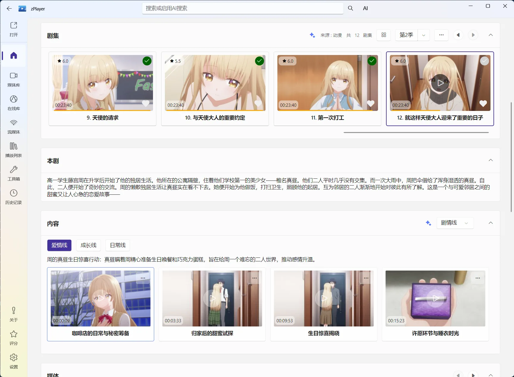

# 媒体详情：一部作品的完整工作台

首页卡片适合快速浏览，媒体详情才是处理一部作品的地方。这里可以确认刮削是否正确、选择季集和片源、开始播放，也可以完成收藏、片单、重新刮削和元数据编辑。

图：媒体详情页把作品资料、播放入口、片源和剧集放在同一处。

## 详情页上能看到什么

不同类型的媒体显示内容会有差异，但通常包括：

- 海报、背景图、标题、原名、年份、评分和简介；
- 题材、国家地区、内容分级、制片公司和演职人员；
- 电视剧的季、集、集标题、播出日期和单集简介；
- 当前作品可用的文件版本、来源和片源；
- 可选的预告片、海报大图、场景缩略图或热门度趋势等信息。

如果你发现整部作品匹配错了，先不要逐字段修改，优先使用“重新刮削”选择正确的 TMDB 条目。

### 章节、剧情与内容结构 {#content-structure}

部分媒体详情会显示章节和剧情栏目：上方可以按集查看已经识别出的章节，下面的内容区域则可以按剧情线、角色或其他语义内容浏览片段。它们不是单纯的剧情文字，而是和视频时间轴相连的内容卡片，点击后可以直接定位或播放对应片段。

媒体详情页这里的内容，和播放器右侧“列表 → 内容结构”看到的是同一套数据，不是两份相互独立的分析结果：

- **还没开始播放时**，适合在媒体详情页先浏览整部作品的章节、剧情线和片段；
- **正在播放时**，适合在播放器的内容结构面板中查看、添加书签或直接跳转；
- 在任一入口生成或维护的章节、剧情内容，另一入口也会同步使用。

如果启用了 AI 章节和故事剧情功能，zPlayer 会根据媒体内容整理章节、剧情线、角色或关键片段。媒体详情页适合在播放前快速了解整部作品的结构，播放器里的“列表 → 内容结构”则适合边看边搜索、跳转和添加书签。AI 结果仍然可以在对应模块中检查和调整，不必把它当成不可修改的固定答案。

图：媒体详情页可以按集查看章节，并按剧情线浏览可直接定位的内容片段；这些内容与播放器的“内容结构”面板互通。

## 电影和电视剧的查看方式不同

### 电影

电影通常直接显示播放入口和可用片源。多个来源存在同一部电影时，可以在详情中确认当前使用的是哪一个来源或版本，再选择更合适的画质、音轨或文件。

### 电视剧

电视剧会按系列、季、集展开。先选择季，再选择集；播放后，继续观看和观看状态会记录到对应的剧集进度。

如果集数没有正确聚合，通常先检查文件名中的季集信息（例如 `S01E01`）和刮削条目是否正确，再决定是否重新刮削。

## 详情页的常用操作

### 播放、切换来源和版本

点击播放后，zPlayer 会使用当前可用的片源。一个媒体有多个来源时，详情页可以帮助你看清它们来自哪个文件服务或媒体服务器；播放前选择更合适的来源，能避免打开了不想用的版本。

### 收藏和加入片单

收藏适合标记“我想长期保留”或“以后还会找”的作品；加入片单适合把作品放进某个具体清单，例如“周末看”“家庭影院测试”。

### 标记观看状态

可以根据实际观看情况标记已观看或保留未完成进度。观看状态会影响“继续观看”“未观看”以及你创建的动态栏目。

### 重新刮削

从媒体详情的操作菜单选择“重新刮削”，搜索并选择正确的 TMDB 作品。它适合解决“整部作品认错”的问题；如果只是改译名、简介、海报或某一集信息，请使用“编辑元数据”。

### 编辑元数据

“编辑元数据”可以针对系列、当前季或当前集修改标题、日期、简介、海报、背景图、Logo，以及题材、地区、制片公司等资料。具体选择建议见[TMDB 与元数据](/docs/media/home/metadata)。

## 投屏、共享播放和播放诊断放在哪里

这些都属于一部具体媒体的操作，不是播放器设置本身，因此在媒体详情相关操作中寻找：

- **投屏**：把当前媒体发送到支持的播放设备。
- **共享播放**：与其他设备或播放端协同播放时使用。
- **播放诊断**：当播放失败、卡顿、音视频不匹配或片源异常时，查看当前媒体和播放链路信息。

播放诊断最好在问题刚出现时打开，并记录使用的来源、片源和错误表现；如果需要向开发者反馈，这些上下文比单独描述“播放不了”更有帮助。

## 看不到海报、片源或按钮怎么办

先按现象判断：

- **没有媒体卡片**：检查来源是否保存成功，以及首页自动刷新是否完成。
- **有卡片但资料错**：重新刮削或编辑元数据。
- **资料完整但没有片源**：检查文件服务连接、权限和文件是否仍然存在。
- **媒体服务器库不完整**：检查连接模式；媒体库模式会读取服务器全部媒体，直连模式则按服务器返回的目录和内容浏览。
- **播放失败**：先换一个来源或版本，再使用播放诊断。

如果仍然是刮削问题，可以从首页右上角“更多”中导出刮削调试信息并邮件反馈；如果是播放链路问题，则同时提供媒体详情中的来源和播放诊断信息。
