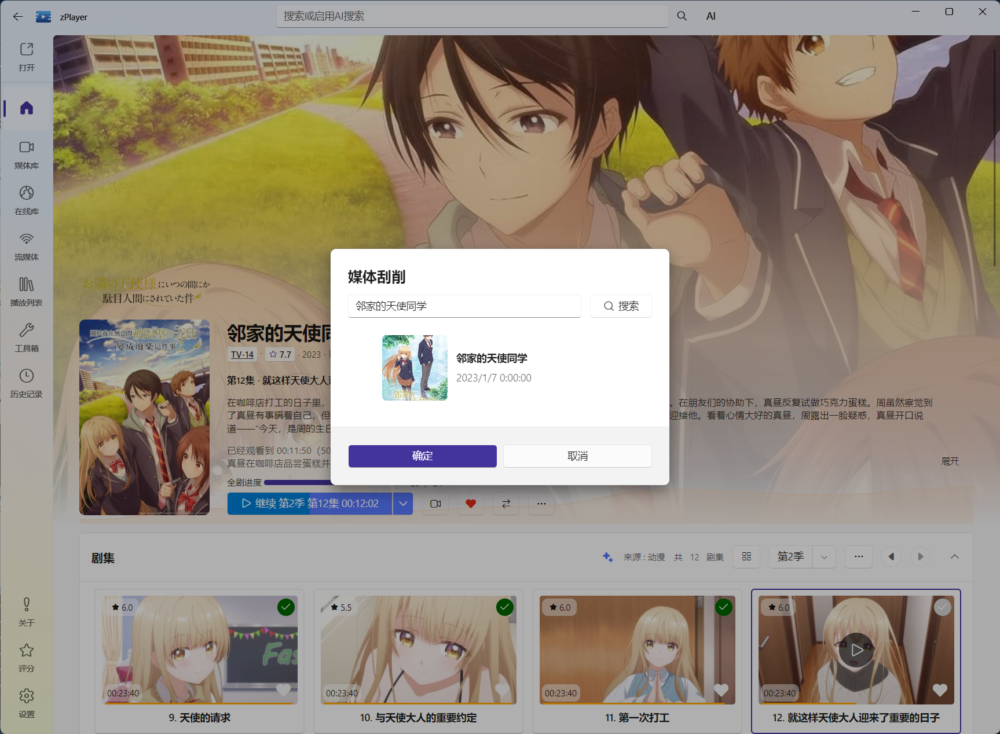
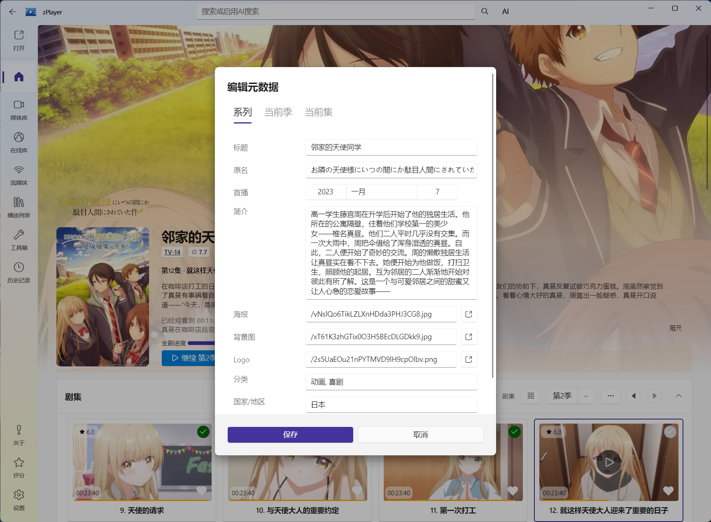

# TMDB 与元数据：匹配正确后再谈海报墙

首页上的海报、标题、年份、简介、评分、演员、剧集和媒体标签，统称为元数据。它们决定了首页能不能按题材、评分、观看状态和完整性进行筛选，也决定了你打开媒体详情时看到的内容是否可信。

## 元数据从哪里来

对于需要刮削的本地目录、NAS 或普通文件服务，zPlayer 会根据文件名、目录和你在连接管理中选择的内容分类，去 TMDB 等元数据服务匹配作品。

对于 Emby、Jellyfin、Plex 等媒体服务器，软件还会读取服务器返回的媒体库、剧集和片源信息。媒体服务器的内容类型由服务器媒体库决定，不需要再手动把它填成电影或电视剧。

::: warning 分类会影响匹配
非媒体服务器来源必须准确选择分类：全是电视剧的目录选“电视剧”，全是电影的目录选“电影”。一个公共根目录混放多种内容，再依赖刮削去猜，容易从第一步就得到错误结果。详情见[文件服务](/docs/media/file-services)。
:::

## 发现匹配错误时，先判断是哪一种问题

| 现象 | 更可能的原因 | 建议 |
| --- | --- | --- |
| 标题完全不相关 | 同名作品、译名或年份不足 | 用“重新刮削”手动搜索 TMDB |
| 作品对了，但海报或简介不喜欢 | 元数据字段需要调整 | 使用“编辑元数据” |
| 电视剧季集错乱 | 目录或集数命名不清，或选错条目 | 先确认 TMDB 条目，再检查季集目录 |
| 首页没有出现 | 来源未保存、仍在刷新，或文件无法访问 | 先检查来源连接和自动刷新状态 |
| 评分、题材等筛选不到 | 元数据未完成或字段为空 | 等刮削完成，必要时重新刮削 |

## 手动选择 TMDB 条目

对单部电影或电视剧进行修复时，推荐使用手动搜索，而不是反复重命名后等待全库重刮：

1. 从首页打开目标媒体的详情页。
2. 在媒体操作菜单中选择“重新刮削”。
3. 搜索时输入尽量明确的关键词；同名作品可加上映年份。
4. 对照海报、年份、国家地区、类型和简介，选中真正的作品。
5. 返回详情页检查系列、季、集和片源是否完整。

手动搜索特别适合电影重名、剧名有多个译名、旧剧翻拍、特别篇和动漫剧场版。选中正确条目后，首页的标题、海报和栏目筛选也会随之改善。

图：重新刮削时，对照海报、年份和简介，从 TMDB 搜索结果中选中正确作品。

## 编辑元数据

如果条目本身已经匹配正确，选择媒体详情中的“编辑元数据”。页面会根据你当前查看的对象提供不同编辑范围：

- **系列**：标题、原名、日期、简介、海报、背景图、Logo、题材、国家地区、制片公司等。
- **当前季**：季标题、季信息和季海报等。
- **当前集**：集标题、播出日期、集简介和集海报等。

编辑时建议先改最影响识别和浏览的字段：标题、海报、年份、简介、季集标题。演员、制片公司、内容分级等信息如果只是用于个人整理，也可以按需要补充。

图：作品已经匹配正确时，可以直接编辑显示资料，不必重新搜索整部作品。

### 什么时候应该重新刮削，什么时候应该编辑

- **匹配到错误的作品**：重新刮削，然后从 TMDB 结果中选正确条目。
- **作品匹配正确，只想换海报或修正标题**：编辑元数据。
- **很多作品都没有资料**：先检查网络、TMDB 配置、来源分类和文件命名，再考虑全库重新刮削。
- **只有某一季或某一集不准确**：进入对应季、集的编辑范围处理，不要为了一个集数重刮整个库。

::: tip 给“缺少海报或评分”做一个栏目
如果你经常整理媒体，可以在[动态栏目](/docs/media/home/layout#动态栏目按条件生成你的首页)中使用“识别状态”或“元数据完整性”条件，自动把待修复的内容集中到首页。修完后它会自然从这个栏目中消失。
:::

## 修改后为什么首页还没变化

自动刷新和刮削是后台过程，来源多、远程服务器响应慢或 TMDB 请求受限时，首页可能不会瞬间完成更新。可以先等待当前任务结束，再重新进入媒体详情确认。

如果只是单部作品持续异常，按[扫描与刮削](/docs/media/home/scraping)中的反馈流程导出刮削调试信息，并把具体作品、来源和期望结果一起发给开发者。
