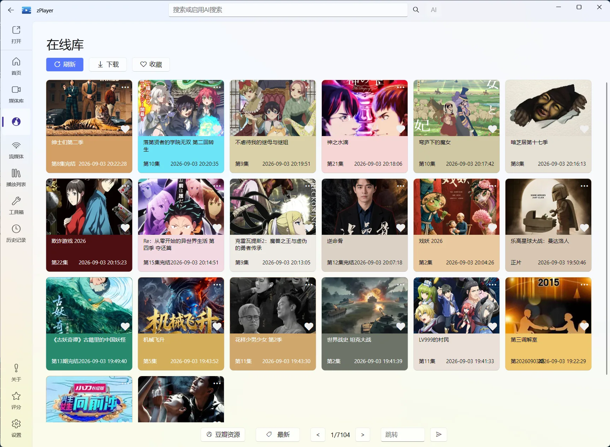

# 在线媒体：不用先整理文件，也能直接找片播放

如果说[文件服务](/docs/media/file-services)是“把自己的文件接进 zPlayer”，在线媒体就是“直接浏览外部站点提供的内容”。它不要求你先下载电影、整理目录或搭建媒体服务器，打开站点后就可以浏览分类、搜索作品、选择线路并播放。

软件界面的正式入口是“在线库”；文档使用“在线媒体”描述这类内容，两者指同一项功能。


<p class="zplayer-screenshot-caption">图：在线库页面按站点和分类展示结果，底部可以翻页或跳转。</p>

::: warning 在线媒体不是 zPlayer 自己提供的片库
zPlayer 只负责读取你配置的站点信息、展示搜索结果和调用返回的播放地址，不托管这些站点的内容。请只添加你有权访问、来源可靠且符合当地法律和站点规则的来源。
:::

## 先记住一条主线

在线媒体的各种站点类型，底层格式虽然不同，但对用户来说做的事情基本一样：

```text
普通浏览站点 / 搜索
        ↓
按“优先打开媒体详情”设置分流
        ↓
开启：尝试匹配 TMDB，成功进入统一详情，失败显示简易弹窗
关闭：直接显示站点线路与剧集选择
        ↓
在详情或弹窗中选择线路和剧集
        ↓
进入播放器播放
```

你不需要先弄懂 Maccms、TVBox、Miru 或 Kazumi 的技术差异。它们只是 zPlayer 读取站点数据的不同方式，真正使用时都围绕“找内容”和“选播放源”。

## 先从与你现有配置匹配的类型开始

如果手中是单个 Maccms 接口，就添加 Maccms；已有 TVBox 订阅、M3U 列表、Miru 或 Kazumi 扩展时，选择对应类型，不需要先转换成另一种格式。

文档不提供站点地址。请从自己信任并有权使用的来源获取配置；详细导入和检测方法见[站点类型与配置管理](/docs/media/online/site-types)。

## 第一次使用

### 1. 先配置一个站点

进入 **设置 → 在线库 → 站点扩展**，打开对应的站点类型并添加或导入配置。

以 Maccms 为例，完成后可以：

- 开启或停用某个站点；
- 检测站点是否可用；
- 为站点设置分组，方便在在线媒体页面切换；
- 在站点列表中查看状态。

不需要为每个站点单独学习一套播放操作。站点能正常检测到分类或内容，就可以进入下一步。

### 2. 进入在线媒体页面

从主导航进入“在线库”。如果侧栏没有显示，可以在“设置 → 模块”中打开在线库模块。

页面底部或筛选区域可以切换：

- 站点分组；
- 当前站点；
- 站点提供的内容分类；
- 上一页、下一页和指定页码。

进入页面后，从站点选择器选择分组和站点。站点信息可以按“设置 → 在线库 → 站点自动更新”保持更新。

### 3. 浏览、搜索和播放

先按分类浏览，或者使用软件顶部的搜索入口搜索片名。点击卡片后的页面取决于“优先打开媒体详情”开关；完整流程见[搜索、线路与播放](/docs/media/online/source-selection)。

## 点击在线媒体后怎样处理

“设置 → 在线库 → 优先打开媒体详情”默认开启，你可以按使用习惯切换：

- **开启**：先获取站点线路并匹配 TMDB；匹配成功进入统一详情，无法匹配时显示简易线路与集数弹窗。
- **关闭**：跳过媒体详情匹配，直接使用站点返回的线路和剧集选择流程。

开启适合先确认作品资料、季集和多个片源；关闭适合只想快速选择站点线路。两种方式都使用同一批在线来源。

无论哪种模式，点击结果都不会自动把它加入本地文件服务，也不会把外部内容下载到你的媒体库。在线媒体和首页管理是两条独立入口。

## 在线媒体和首页管理的区别

| 功能 | 在线媒体 | 首页管理 |
| --- | --- | --- |
| 内容从哪里来 | 外部站点实时返回 | 本地、NAS、媒体服务器等已连接来源 |
| 是否需要整理文件 | 不需要 | 长期使用时建议整理目录和命名 |
| 主要操作 | 浏览、搜索、选线路、播放 | 扫描、刮削、收藏、栏目和片源管理 |
| 作品资料 | 由站点返回，或尝试匹配 TMDB | 由来源扫描和刮削建立 |
| 内容是否自动出现在首页 | 不会自动加入 | 来源保存后首页会自动刷新和刮削 |

首页的联网推荐点击后，也可能使用已配置的在线媒体来源寻找播放片源；这和直接进入在线媒体页面浏览，是同一批在线来源的两种入口。推荐行为详见[搜索、分类与推荐](/docs/media/home/search-and-recommendation#online-recommendation)。

## 按需求继续查看

| 你想做什么 | 对应页面 |
| --- | --- |
| 了解 6 种站点类型的区别 | [站点类型](/docs/media/online/site-types) |
| 添加站点后开始浏览 | [搜索、线路与播放](/docs/media/online/source-selection) |
| 处理无结果、线路失效或播放失败 | [搜索、线路与播放](/docs/media/online/source-selection#遇到问题先判断是哪一层) |
