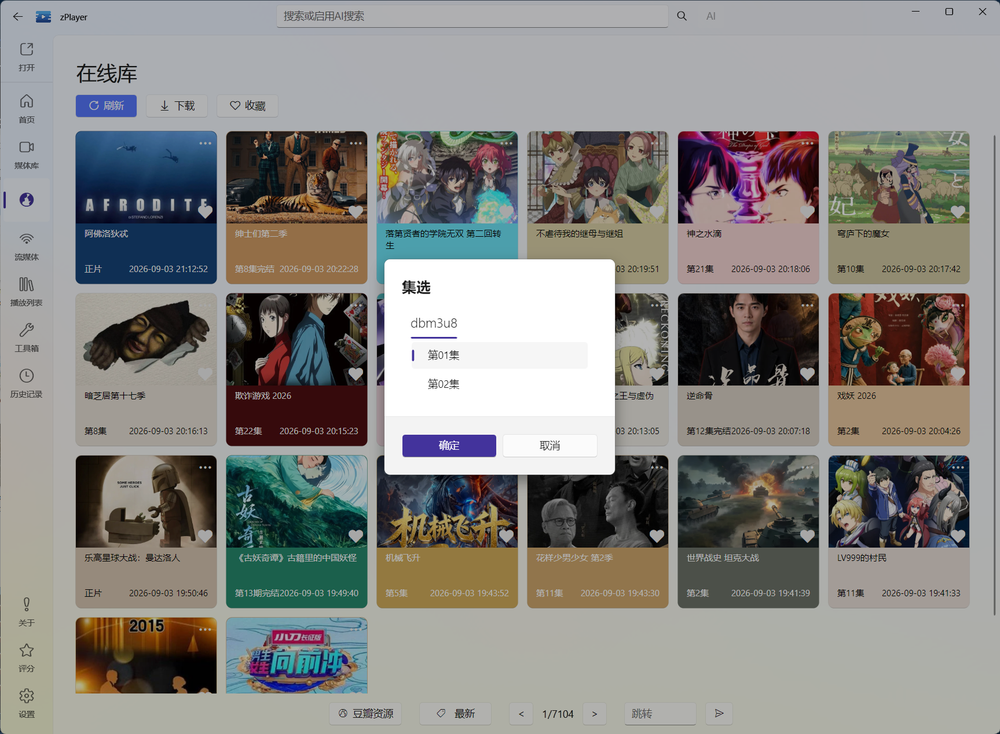

# 搜索、线路与播放

在线媒体最常用的就是这一条流程：**普通浏览站点或搜索 → 尝试匹配 TMDB → 进入统一媒体详情 → 选择线路和剧集 → 播放**。

在线媒体采用统一的媒体详情体验：找到作品后会先从 TMDB 查找元数据，匹配成功时，线路和剧集选择会直接放在媒体详情页中。只有 TMDB 找不到匹配时，才会使用简易的线路与集数弹窗作为兜底。下面按实际点击软件的顺序说明。

## 第一步：选站点和分类

进入主导航的“在线媒体”（软件界面可能显示“在线库”）后，先选择站点：

1. 点击站点选择器，先选站点分组。
2. 在分组中选择具体站点。
3. 等待站点返回内容分类。
4. 点击分类，浏览当前分类的媒体列表。

如果你配置了多个站点，可以在这里快速切换，不用退出页面重新加载。不同站点的分类名称和内容数量可能不同，这是站点返回的数据，不是 zPlayer 统一生成的分类。

底部的页码可以翻页，也可以输入页码跳转。站点响应慢时，先等当前请求完成；如果已经确定站点异常，可以点击“刷新”重试或切换其他站点。

## 第二步：搜索作品

使用软件顶部的搜索入口，在当前在线媒体页面中搜索关键词。建议按下面的顺序尝试：

- 先输入常用中文片名；
- 没有结果时，尝试原名、英文名或更短的关键词；
- 电视剧不要一开始就把季名、年份和特殊符号全部塞进去；
- 换一个站点再搜索，因为不同站点的收录和命名不一样。

搜索结果只代表当前站点返回了匹配项。一个站点搜不到，不代表其他站点也没有。

## 第三步：点击结果，进入统一媒体详情

点击作品卡片后，在线媒体会先尝试从 TMDB 查找这部作品的元数据。这个过程不是为了替换在线站点，而是为了让在线内容也能使用统一的标题、海报、简介、季集和媒体详情界面。

### TMDB 匹配成功：在媒体详情中选择线路

匹配成功后，作品会进入统一的媒体详情页。你可以先确认作品资料，再在详情页中选择季、集和在线片源；线路选择不再是在线媒体页面上的独立步骤，而是详情页内的一部分。

### TMDB 找不到匹配：使用简易弹窗兜底

如果站点返回的标题、类型或其他信息无法匹配到 TMDB，zPlayer 不会因此阻止播放，而是显示简易的线路与集数选择弹窗。选择线路和集数后点击确定，就可以直接进入播放器。

图：TMDB 找不到匹配时，在线媒体使用简易弹窗选择线路和集数作为播放兜底。

因此，在线媒体不需要用户在设置中切换“详情模式”和“直接线路模式”：正常结果走统一媒体详情，无法匹配的结果自动走简易弹窗。

## 第四步：在媒体详情中选择线路

同一个作品经常会返回多条线路。线路可以理解为不同的播放通道：它们可能来自不同的上游、解析方式或服务器，速度和稳定性不一定一样。匹配成功时，你会在媒体详情的在线片源区域看到这些线路。

选择时可以优先考虑：

- 当前响应正常、加载速度较快的线路；
- 集数完整、命名清楚的线路；
- 能稳定播放当前清晰度和格式的线路。

线路名称不一定代表真实画质或绝对速度，最终还是以实际播放效果为准。一个线路打不开时，直接回到选择面板换另一条，通常比反复修改播放器设置更有效。

## 第五步：选择剧集并播放

电影一般选择对应播放线路即可；电视剧还需要先选择季和集：

1. 先确认当前季是否正确。
2. 在详情页的剧集列表中选择要看的集数。
3. 查看该集可用的线路或片源，选择一个响应正常的来源。
4. 确认后进入播放器。

不同站点的剧集名称、季数和更新速度可能不同。站点显示“全 12 集”不代表其他线路也有 12 集；如果某一集缺失，可以切换线路或站点搜索。

## 遇到问题先判断是哪一层

| 现象 | 先检查什么 | 建议处理 |
| --- | --- | --- |
| 站点列表为空 | 站点是否启用、配置是否正确 | 到站点设置中检测可用性 |
| 分类加载不出来 | 当前站点接口或网络 | 刷新后换一个站点 |
| 搜索没有结果 | 关键词和站点收录 | 换短关键词、原名或其他站点 |
| 有结果但没有线路 | 站点返回不完整 | 刷新、换站点或稍后重试 |
| 线路能看到但无法播放 | 当前线路或解析服务 | 回到选择面板切换线路 |
| 详情匹配不准确 | TMDB 匹配与站点命名不同 | 重新搜索或换关键词；完全无法匹配时使用简易弹窗选择线路和剧集 |
| 电视剧缺季或缺集 | 站点数据或该线路收录不完整 | 换线路、换站点，或使用其他来源 |

如果多个站点都无法加载，优先检查本机网络；如果只有一个站点失效，通常是外部站点自身的问题。zPlayer 只能调用站点返回的地址，不能修复已经下架或失效的外部内容。

## 在线媒体结果不会自动加入首页

在线媒体中的作品可以收藏、下载或发送到其他设备，但它不会因为你点击播放就自动变成本地媒体，也不会自动进入首页的刮削库。想长期管理自己的文件，应把本地目录、NAS 或媒体服务器添加到[文件服务](/docs/media/file-services)；想临时浏览和播放外部内容，留在在线媒体即可。

首页右上角“更多 → 联网推荐”也能把推荐作品交给在线媒体来源尝试匹配片源，具体见[联网推荐](/docs/media/home/search-and-recommendation#联网推荐先弄清推荐从哪里来点进去会发生什么)。
