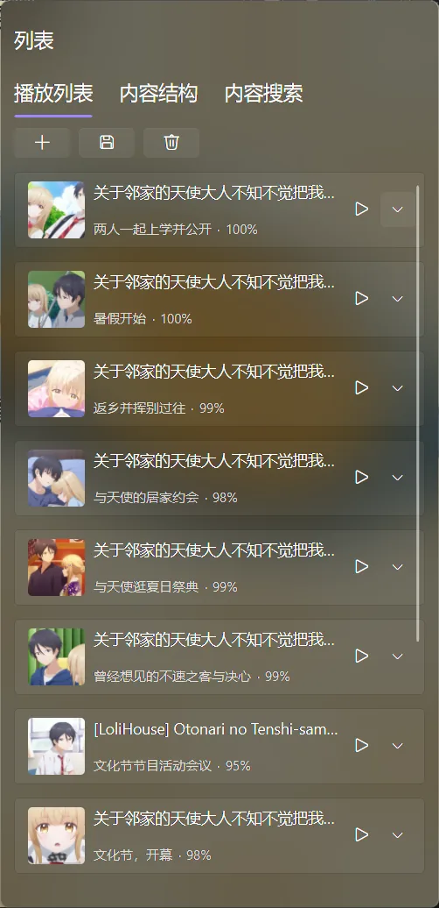
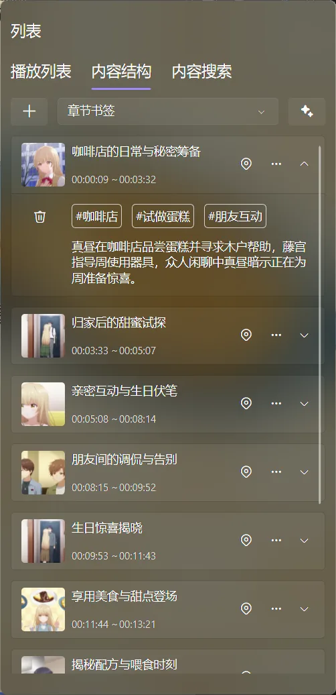
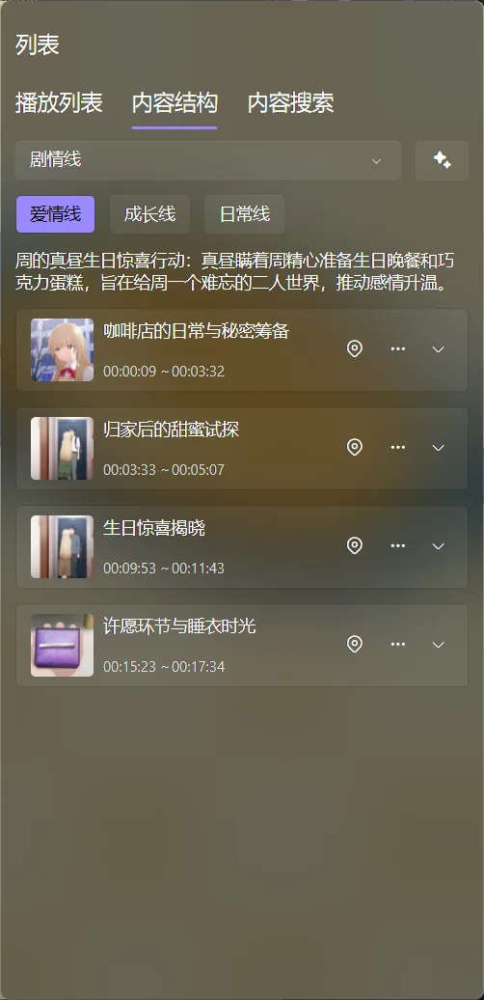
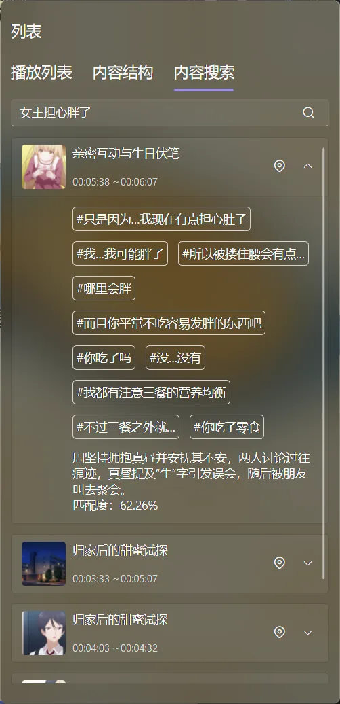

# 播放列表里的内容模块：章节、剧情与内容搜索

播放器底部右侧有一个“列表”按钮。打开后你会看到三个标签：**播放列表**、**内容结构**和**内容搜索**。

它们解决的是三种不同的问题：

- 播放列表：接下来播放哪些媒体？
- 内容结构：这一部视频有哪些章节、剧情线和可定位的内容？
- 内容搜索：我记得某个场景，但忘了它在第几分钟，怎么找回来？

播放列表中的内容模块对应后两个标签。软件界面里，“故事剧情”主要通过“内容结构”中的“剧情线”以及角色、关键物品等视图呈现。

媒体详情页也有章节和剧情栏目。详情页适合在播放前纵览一部作品，播放器面板适合边看边定位；两边使用的是同一套章节、剧情和内容结构数据，在一个入口生成或维护后，另一个入口也会跟着使用。详情页的实际样式可以参考[媒体详情：章节、剧情与内容结构](/docs/media/home/media-detail#content-structure)。

## 播放列表：管理当前待播内容

“播放列表”是当前播放器的待播队列，不等同于首页的媒体栏目。

### 添加和调整队列

点击“添加”，可以选择：

- **本地视频**：从电脑中选择视频文件；
- **流媒体**：添加一个流媒体地址。

两类内容都可以选择“插入下一项”或“添加到队尾”。队列中的媒体可以直接播放、上移、下移或移除；展开一项后还能查看海报、集数、进度、大小、时长、描述和路径等信息。

清空待播队列只会清除当前队列，不会删除本地文件，也不会删除 NAS 或媒体服务器上的媒体。

### 队列和保存的播放列表

临时想连续看几段内容，直接调整当前队列即可；以后还想重复使用，就点击保存，把队列保存为播放列表。比如把一组教程、几部演唱会或“周末待看”内容整理成固定清单。

队列负责“现在怎么播”，保存的播放列表负责“以后还想这样播”。首页的固定片单和动态栏目，则属于[首页管理](/docs/media/home/playlists)的内容组织功能。

图：播放列表标签页负责管理当前待播队列，适合临时连续播放或保存成固定清单。

## 内容结构：给视频建立可以点击的目录

打开“内容结构”后，软件会把当前媒体的时间轴内容整理成可以点击定位的卡片。每张卡片通常包含缩略图、名称、开始时间、结束时间、标签和描述；点击定位按钮即可跳到该片段。

图：内容结构把章节、剧情线和语义标签整理成可以点击定位的内容目录。

### 章节书签：给时间轴留下自己的标记 {#chapter-bookmarks}

适合手动记录：精彩片段、重要知识点、名场面、需要复习的对白，或者下一次想直接跳过的片头片尾。

操作步骤：

1. 播放到片段开始的位置，打开播放器右侧的“列表”。
2. 切换到“内容结构”，点击添加书签。
3. zPlayer 会以当前播放位置作为起点，并先给出一个默认的章节名称和结束位置。
4. 打开书签的编辑入口，修改名称、开始时间、结束时间、标签和概要描述。
5. 之后点击书签卡片的定位按钮，就能回到这个片段。

书签还支持把当前播放位置重新设为起点或终点、设置整个书签区间循环，以及导出区间视频或动图。进度条也可以显示章节书签标记，适合边看边定位。

### AI 章节和故事剧情

内容结构顶部的 AI 按钮可以根据字幕或语音识别内容生成章节。生成后，可以从下拉菜单切换查看：

图：AI 内容结构把视频拆成章节，并可以进一步查看剧情线、角色和关键物品等语义内容。

- 时间场景；
- 章节书签；
- 剧情线；
- 角色；
- 关键物品；
- 世界设定；
- 情绪；
- 主题。

选择“剧情线”时，可以把一部电影或一集电视剧里相关的剧情发展串起来；选择角色、关键物品等项目时，则可以点击某个语义标签，筛出与它相关的片段。它不是把视频重新剪辑，而是为原本连续的时间轴增加一层“能理解内容的目录”。

生成 AI 章节前，需要有可分析的字幕，或者在首页设置中启用 Whisper 媒体内容识别；同时需要在 AI 设置中准备聊天模型和嵌入模型。没有字幕、模型未配置或识别索引尚未建立时，AI 按钮可能无法生成结果。

AI 自动生成的章节适合快速建立目录；如果名称或时间不够准确，可以删除后重新生成。用户自己添加的书签则可以继续编辑，建议把真正重要的片段手动整理成清晰的标题和标签。

## 内容搜索：用一句话找回视频片段 {#content-search}

“内容搜索”不是首页的标题搜索，也不是“搜索字幕”。它只针对当前正在播放的媒体建立语义索引；播放电视剧时，通常就是当前这一集。

在搜索框里直接描述你记得的内容，例如：

- `主角第一次在雨中见面`；
- `出现外星飞船降临城市上空的场景`；
- `讲父子和解的那段对话`；
- `主角是失忆侦探时提到的线索`。

搜索结果会以片段卡片展示相关缩略图、名称、起止时间、标签和描述。点击定位按钮即可跳到对应位置；展开卡片可以先看更完整的内容，再决定是否播放。

图：内容搜索可以用自然语言寻找当前视频中的具体片段，再直接跳转到对应时间。

### 内容搜索需要什么

使用前需要：

1. 在 AI 设置中配置默认嵌入模型。
2. 在首页设置中开启媒体内容语义搜索。
3. 等待媒体库刷新或当前媒体建立内容检索数据。
4. 确认媒体有字幕；没有字幕时，先使用 Whisper 媒体内容识别。

如果没有看到“内容搜索”标签或搜索按钮，通常是嵌入模型、媒体语义搜索尚未配置，或者当前媒体还没有可用的内容索引。可参考[AI、Whisper、RSS 与模块](/docs/settings/ai-and-modules)。

## 三个标签怎么选

| 你想做的事 | 应该打开 |
| --- | --- |
| 让几段视频按顺序播放 | 播放列表 |
| 记住某个时间点，之后一键跳回 | 内容结构 → 章节书签 |
| 看 AI 整理出的故事发展和人物关联 | 内容结构 → 剧情线、角色等 |
| 记得场景内容，但不知道时间位置 | 内容搜索 |
| 找一部作品或某一集 | 首页搜索或媒体详情 |
| 找一份字幕文件 | 播放器菜单 → 搜索字幕 |

::: tip 一个很实用的组合
第一次看长电影时，用内容搜索找回“我刚才错过的那段”；第二次看时，把真正重要的片段整理成章节书签；需要复习多个片段时，再把对应媒体加入播放列表。这样播放队列、时间轴目录和语义检索各自做擅长的事，使用起来不会混在一起。
:::
