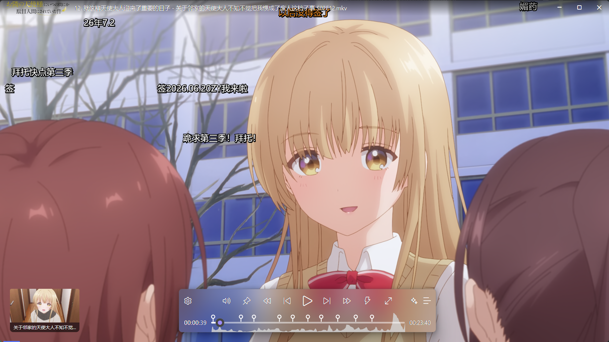
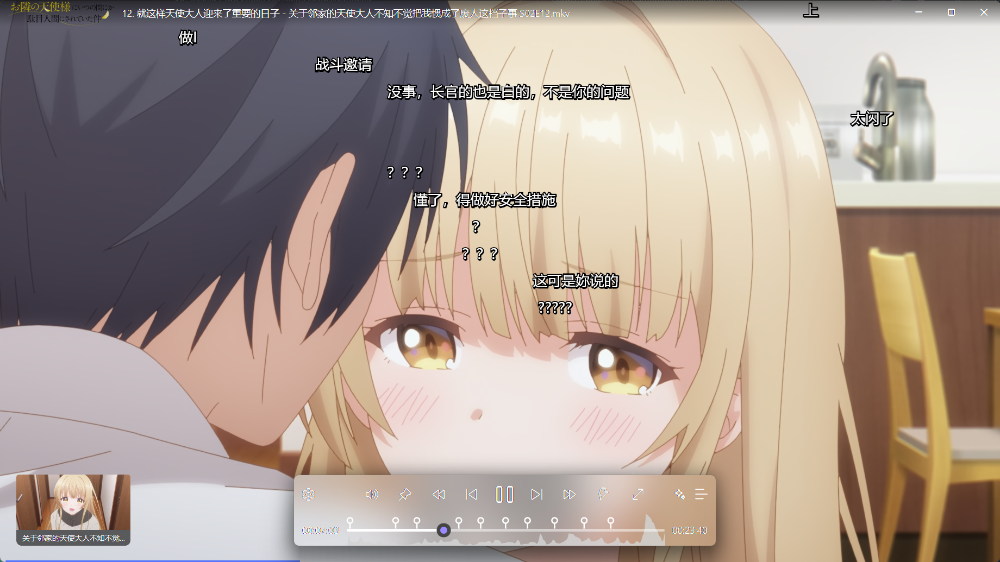

# 播放器：从打开片源到看懂每一段内容

播放器是 zPlayer 把“媒体库里的一个条目”变成实际观看体验的地方。片源可以来自本地文件、NAS、Emby、Jellyfin、Plex、在线媒体，打开后的控制方式基本一致。

第一次使用时不用急着改一大堆选项：先用默认设置播放一段，确认片源、声音和字幕都正常，再根据实际问题调整。这样出了问题也知道是哪一项设置造成的。

图：播放器控制栏可以在观看时调出，画面中也可以同时显示字幕和弹幕。

图：高能进度条会把音频波形、章节标记和当前播放位置放在同一条时间线上，找片段时比盲拖更直观。

## 先记住三个入口

- 想换片源、季集、收藏或查看播放诊断：回到[媒体详情](/docs/media/home/media-detail)。
- 想调整播放器、解码、字幕或画质的默认行为：查看[播放、解码与画质设置](/docs/settings/playback)。
- 想在视频里记住某个片段、按剧情找回一段内容：打开播放器右侧的“列表”面板，查看[播放列表与内容模块](/docs/player/content-modules)。

投屏、共享播放和播放诊断属于媒体详情中的具体媒体操作；播放器文档聚焦播放过程中的控制、画面和内容定位。

## 播放器功能索引

| 序号 | 页面 | 适合什么时候看 |
| --- | --- | --- |
| 1 | [播放器界面](/docs/player/interface) | 第一次打开播放器，找不到控制按钮、缩略图或高能进度条 |
| 2 | [播放控制与快捷操作](/docs/player/controls) | 手势、快进、切集、倍速、片头片尾、快捷键或 A-B 循环 |
| 3 | [播放内核、解码与硬件加速](/docs/player/engine-and-decoder) | 黑屏、卡顿、花屏、CPU/GPU 占用异常 |
| 4 | [画质与滤镜](/docs/player/video-quality) | 画面比例、旋转、翻转，以及动漫着色器和滤镜推荐 |
| 5 | [音乐播放器](/docs/player/music) | 在线音乐、歌单、动态歌词和 PV 歌词动画 |
| 6 | [音频与均衡器](/docs/player/audio) | 无声、音轨不对、音量或均衡器调整 |
| 7 | [字幕](/docs/player/subtitles) | 内封字幕、外挂字幕、翻译、动画、多字幕和字幕样式 |
| 8 | [弹幕](/docs/player/danmaku) | 加载、显示或调整弹幕 |
| 9 | [Whisper AI 字幕](/docs/player/whisper) | 没有字幕，或需要实时识别、翻译语音 |
| 10 | [播放列表与内容模块](/docs/player/content-modules) | 管理待播内容、章节书签、故事剧情和内容搜索 |

## 推荐的排查顺序

遇到问题时，可以按下面的顺序缩小范围：

1. 确认当前媒体或当前集确实有可访问的片源。
2. 用默认解码和默认画质设置重新打开一次。
3. 画面异常时，先检查解码和硬件加速，再关闭滤镜或着色器。
4. 声音、字幕、弹幕分别检查各自的轨道和面板，不要把它们当成同一个问题。
5. 如果只是想回到某个剧情片段，优先用章节书签或内容搜索，不必反复拖动进度条。

::: tip 播放器和媒体库的分工
播放器负责“怎么播放、怎么定位、怎么调整体验”；媒体库和媒体详情负责“这是什么、来自哪里、有哪些集数和片源”。知道这个分工后，遇到片源缺失、刮削错误或播放诊断问题，就不会在播放器设置里绕圈。
:::
