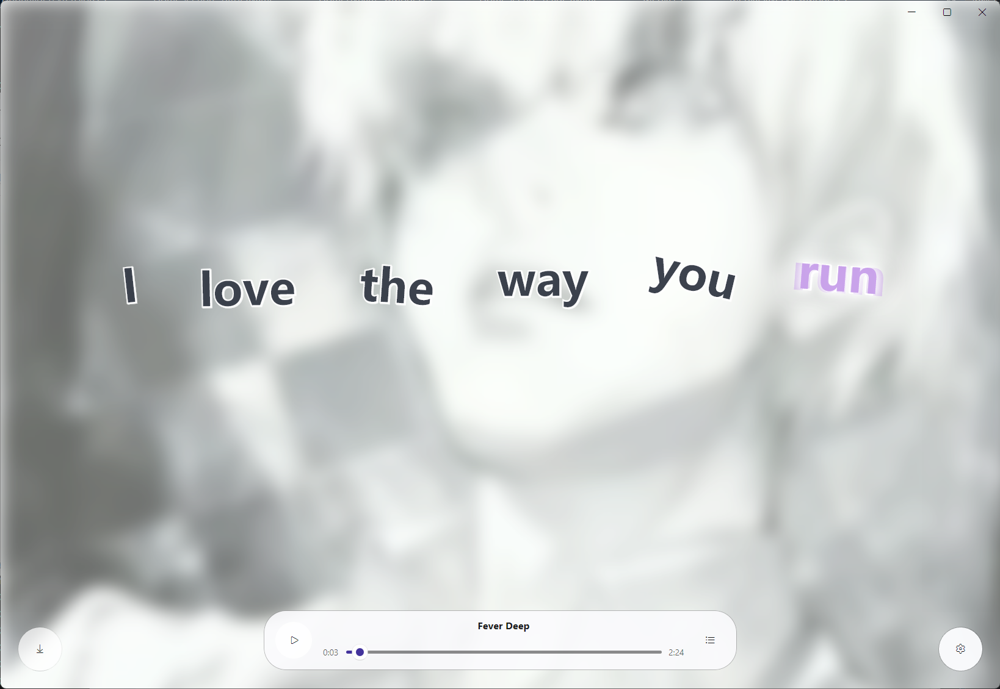

# 音乐播放器：把歌单、封面和歌词放在一起

zPlayer 播放音乐时，会打开独立的音乐播放器，而不是把音频硬塞进视频播放器。它更像一个专门为歌曲准备的小型播放空间：背景使用专辑封面，底部负责播放控制，歌词负责跟着音乐变化。

如果你只是偶尔打开一个本地音频文件，双击文件即可；如果你有一批音乐，或者想使用网易云音乐、QQ 音乐中的歌单，建议先通过[文件服务](/docs/media/file-services)添加来源。这样歌单、播放记录和音乐栏目才能长期保留下来。

## 在线音乐：先登录来源，再从歌单开始

在线音乐主要通过网易云音乐和 QQ 音乐连接使用。它们属于“在线音乐”来源，不走电影、电视剧的 TMDB 刮削流程，内容类型会固定为“音乐”，不能改成电影或电视剧。

第一次使用可以按这条路径操作：

1. 进入“媒体库 → 连接管理”，选择“在线音乐”分类。
2. 选择网易云音乐或 QQ 音乐，按页面提示使用手机扫码登录。
3. 保存连接，回到首页等待在线音乐栏目自动刷新。
4. 打开歌单，选择一首歌曲；歌曲会交给独立音乐播放器播放。

在线音乐来源和本地音乐的区别在于：在线歌曲、封面、歌词和播放地址由服务返回，登录状态失效或来源暂时不可用时，首页可能暂时无法加载对应内容。重新登录或刷新来源即可，不需要把它当成 TMDB 刮削错误处理。

## 首页上的在线音乐栏目

在线音乐登录成功后，首页可以把来源中的歌单和歌曲组织成栏目。栏目中的卡片通常会显示封面、歌曲名称、歌手和播放状态；点击歌单可以继续浏览，点击歌曲则直接进入播放。

它和首页的电影、电视剧栏目是两条不同的内容链路：电影和电视剧关注作品、季集和片源，音乐关注歌单、歌曲、歌手、专辑和歌词。在线音乐不会因为播放过一次就变成 TMDB 媒体，也不会自动加入电影或电视剧的刮削库。

## 独立音乐播放器里有什么

打开歌曲后，音乐播放器会用当前歌曲的封面作为背景，并提供一组适合连续听歌的控制：

- 播放、暂停、上一首和下一首；
- 拖动进度、调整音量和播放速度；
- 播放完停止、单曲循环、顺序播放和随机播放；
- 打开播放列表，添加下一项、追加到队尾、调整顺序、移除或清空待播内容；
- 查看歌曲名、歌手和专辑，并点击对应信息进行复制；
- 在线歌曲显示“保存到本地”入口，下载成功时会尽量把原文歌词保存为同名 `.lrc` 文件。

播放列表只影响当前音乐播放器窗口。临时想连续听一组歌时，直接调整当前队列；以后还想重复使用，再把队列保存成播放列表。

## 动态歌词：不是一张静态歌词图

有歌词时，zPlayer 会按照歌曲时间轴逐行显示歌词，当前句会随着播放位置推进；如果来源同时提供译文，译文会在歌词下方单独显示。这样听在线歌曲时，可以同时看到原文和译文，不需要手动反复暂停找下一句。

歌词来源有两种：

- **在线音乐**：优先读取网易云音乐或 QQ 音乐返回的歌词和译文；
- **本地音乐**：优先自动匹配歌曲旁边的同名歌词文件，也可以在歌词设置中手动打开 `.lrc` 等歌词文件。

歌词没有加载出来时，先看播放器设置面板显示的歌词来源；如果来源为空，可以点击“打开歌词”手动选择文件。歌词整体提前或延后时，用“字幕延迟”左右调整，不要先去修改歌曲文件本身。

图：独立音乐播放器将专辑封面、动态歌词和播放控制放在同一个窗口中。

## PV 歌词动画：让歌词更像音乐视频

音乐播放器的设置面板中有独立的 PV 动画标签，可以调整歌词的表现方式：

| 选项 | 作用 | 建议 |
| --- | --- | --- |
| 字间距 | 调整歌词字符之间的距离 | 歌词较长或字体较大时，从较小值开始 |
| 强调缩放 | 当前歌词被强调时的放大程度 | 想突出当前句时增加，过大可能影响连续阅读 |
| 光晕强度 | 当前歌词的发光效果 | 深色封面上适当增加即可 |
| 动画安全区域 | 限制歌词动画不要贴近窗口边缘 | 小窗口或歌词较长时适当调大 |
| 波浪动画 | 让歌词按音乐播放器的节奏产生波浪变化 | 喜欢 MV 感觉时开启，追求稳定阅读时关闭 |
| 波浪幅度、周期 | 控制波浪变化的大小和速度 | 先使用中等值，避免文字晃动过强 |

推荐先保持默认值播放一首完整歌曲，再一次只调整一项。PV 动画更适合歌词、音乐视频和演唱会内容；如果只是看普通对白或学习文字，使用普通字幕样式会更清楚。

## 音乐播放器和视频播放器怎么分工

音乐播放器负责歌曲、歌单、封面、歌词和连续播放；视频播放器负责画面、字幕、弹幕、片头片尾和画质处理。两者都能记录播放进度，也都能使用播放列表，但控制界面不会完全相同。

遇到音频轨道、系统输出设备或均衡器问题，查看[音频与均衡器](/docs/player/audio)；想查询默认播放模式和播放器相关设置，查看[播放、解码与画质设置](/docs/settings/playback)。

::: tip 一条最省心的使用习惯
在线音乐先从一个歌单开始测试：确认登录、封面、歌词和播放都正常后，再把其他歌单加入首页。歌词效果不满意时，只调整歌词延迟或 PV 动画，不要同时修改音量、播放速度和系统音频输出，这样更容易找到真正影响体验的选项。
:::
