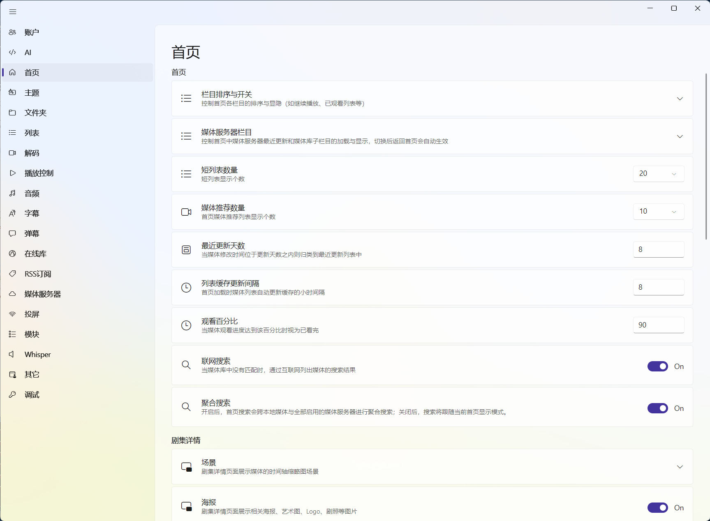

# 首页设置：把首页调成适合你的样子

入口是“设置 → 首页”。

首页设置不是“刮削按钮的集合”，它更像是首页的布局和数据来源控制台：决定显示哪些栏目、每个栏目放多少内容、搜索要搜到哪里，以及媒体详情页要不要加载额外信息。

如果你只是想把电影和电视剧整理成海报墙，保留默认值通常就够了。等来源和刮削结果稳定后，再回来按自己的使用习惯调整。

图：首页设置集中控制栏目、推荐数量、联网搜索和剧集详情显示方式。

::: tip 只想播放一个文件？
资源管理器双击文件，或者使用左上角的“打开文件”会更快。首页设置主要服务于长期维护的媒体库，详细流程见[首页管理](/docs/media/home-management)。
:::

## 先理解首页会显示什么

首页内容大致来自四个方向：

| 内容 | 依赖什么 | 适合怎么用 |
| --- | --- | --- |
| 本地或 NAS 媒体 | [文件服务](/docs/media/file-services)中的目录和文件 | 按自己的片库浏览 |
| Emby、Jellyfin、Plex 等 | 媒体服务器来源 | 展示服务器返回的媒体库 |
| 最近观看、继续观看 | 本机播放记录或服务器播放进度 | 打开软件接着看 |
| 推荐、分类、动态栏目 | 媒体元数据、观看记录和栏目条件 | 把首页变成个人化的入口 |

所以某个栏目没有内容，不一定是设置错了。先看它依赖的来源有没有加载成功、媒体有没有刮削到资料。

## 栏目开关与栏目布局

### 媒体推荐

关闭后，首页不会显示推荐列表，但不会删除媒体，也不会影响搜索和手动浏览。首页比较简洁、或者你只把它当作片库入口时，可以关闭。

### 首页栏目导航

开启后，首页顶部会显示栏目导航，点击可以快速跳到对应位置。栏目很多时建议保留；如果你更喜欢连续滚动，可以关闭。

### 栏目顺序和显示状态

栏目编辑器可以调整顺序、隐藏不想看的栏目，也可以整理来源栏目的顺序。它改变的是首页呈现方式，不会移动文件、不删除数据，也不会修改连接管理中的来源。

这里尤其值得花一点时间配置：例如把“继续观看”放在前面，把不常用的推荐栏目放到后面。想创建“最近添加的动画”“评分较高的科幻片”这类根据条件自动变化的栏目，见[首页栏目与布局](/docs/media/home/layout)。

## 媒体服务器栏目

这两项只影响首页中由媒体服务器提供的栏目：

| 设置 | 开启后的效果 |
| --- | --- |
| 最近更新列表 | 显示服务器近期新增或更新的媒体 |
| 媒体库列表 | 按服务器返回的媒体库展示入口 |

如果你主要使用本地目录，关闭它们不会影响本地媒体。服务器数量很多时，打开过多来源栏目可能让首页变长，也会增加首次加载的请求量。

## 数量、时间和缓存

以下是新配置下的常见默认值。已有配置或升级后的版本可能保留你以前的选择。

| 设置 | 默认值 | 它控制什么 |
| --- | ---: | --- |
| 短列表数量 | 20 | 最近观看、最近更新等短列表显示多少项 |
| 媒体推荐数量 | 10 | 推荐栏目显示多少项 |
| 最近更新天数 | 8 天 | 文件修改时间在多少天内时归入最近更新 |
| 列表缓存更新间隔 | 12 小时 | 首页加载时，多久重新检查一次媒体列表缓存 |
| 观看百分比 | 90% | 播放进度达到多少时视为已经看完 |

这里的“列表缓存更新间隔”不是强制每 12 小时重新刮削整个片库，而是控制列表数据的自动更新节奏。首次加入大量媒体时，仍然要给扫描和刮削留出时间。

如果你经常打开软件就想看到刚下载的内容，可以缩短最近更新天数或缓存间隔；如果首页请求太多、启动较慢，则可以适当增大缓存间隔。

## 搜索范围

### 联网搜索

开启后，首页搜索可以把在线媒体站点纳入结果。它适合“本地没有这部片，想顺便看看在线来源”的场景；关闭后，搜索会更专注于已经加入 zPlayer 的内容。

联网搜索结果不是本地文件，也不代表每条线路都可用。在线媒体的实际流程是“普通浏览或搜索 → 选择线路 → 播放”，见[在线媒体](/docs/media/online-media)。

### 聚合搜索

开启后，首页会跨本地来源和媒体服务器来源一起搜索；关闭后，只在当前首页显示模式对应的范围内搜索。

来源很多时，聚合搜索更方便；如果你只想快速查当前某一个媒体库，可以关闭它，减少无关结果。

## 媒体详情显示

### 场景缩略图

可以为每个来源单独决定是否显示剧集场景缩略图。场景图会增加请求、加载时间和缓存占用，因此软件会按来源类型给出一个智能默认值：

- 本地文件和部分内网来源通常默认开启；
- 网盘、对象存储或外网域名通常默认关闭，以节省流量；
- 内网媒体服务器通常默认开启，外网域名通常默认关闭。

如果某个来源速度快、流量不敏感，可以单独打开；如果打开详情页明显变慢，优先关闭该来源的场景图。场景图属于媒体详情模块，不是播放器设置，详见[媒体详情](/docs/media/home/media-detail)。

### 海报、热门度和剧情回顾

| 设置 | 作用 |
| --- | --- |
| 海报 | 控制媒体详情中的海报画廊是否显示 |
| 最近一周热门度趋势 | 显示最近一周的热度变化信息 |
| 剧情回顾 | 在详情中显示与观看进度相关的剧情回顾内容 |

这些选项关闭后只是不显示对应模块，不会删除已经刮削到的资料。

## 语义搜索

首页里的语义搜索需要 AI 嵌入模型参与，不是普通的标题关键词搜索。

| 设置 | 作用 |
| --- | --- |
| 媒体概览 | 使用标题、简介等概览信息建立语义索引 |
| 媒体内容 | 使用视频内容相关信息建立语义索引 |
| Whisper 媒体内容识别 | 先用 Whisper 识别媒体内容，再参与语义索引 |

开启后可能会增加首次处理时间、磁盘占用和 AI 调用费用。没有配置嵌入模型时，这些开关不会凭空产生搜索能力；先看[AI、Whisper、RSS 与模块](/docs/settings/ai-and-modules)，确认模型和隐私边界。

## 历史记录与同步

“追剧记录同步”控制相似剧集之间是否共享观看状态。Bangumi 和 Trakt 的账号授权、拉取与推送开关也位于“设置 → 首页 → 历史记录”。

媒体服务器的播放进度不需要在这里额外打开一个总开关：使用服务器来源播放时，zPlayer 会按服务器能力尝试同步开始、进度和停止状态。完整的同步方向和异常处理见[同步功能概览](/docs/sync/)。

## 刮削与 TMDB

### TMDB 密钥

留空时使用软件内置的密钥；填写自己的 TMDB API Key 后，刮削请求会使用你的密钥。密钥属于敏感信息，不要截图公开，也不要把它贴到问题反馈中。

### 成人媒体

“启用成人媒体”控制本地刮削时是否识别这类媒体，以及是否显示相关栏目。“在媒体分类外显示成人媒体”还会决定它们是否出现在观看状态、最近更新、随机推荐、分类和全局搜索等普通栏目中。

如果你不需要这类内容，建议安装后就关闭两个相关选项。ThePornDB 访问令牌是可选的；只有在确实需要对应资料时再填写，并把令牌当作密码保管。

### 语言、地区和图片质量

| 设置 | 常见值 | 说明 |
| --- | --- | --- |
| TMDB 区域代码 | CN | 影响地区相关的内容选择和结果偏好 |
| TMDB 默认语言 | zh | 影响标题、简介等文本优先使用的语言 |
| TMDB 默认图片语言 | zh | 影响海报、Logo 等图片的语言偏好 |
| 封面图质量 | 小 | 影响海报下载尺寸、清晰度和流量 |
| 背景图质量 | 大 | 影响详情页背景图 |
| 剧集图质量 | 大 | 影响剧集或场景相关图片 |

如果标题或简介语言不对，先检查默认语言和区域代码；如果图片加载慢或缓存增长很快，再降低图片质量。修改这些值只影响之后的加载或重新刮削，不会自动修复已经匹配错误的作品。

## 给大多数用户的推荐值

刚开始使用时可以这样保留：

- 栏目推荐和栏目导航开启；
- 短列表 20、推荐 10、最近更新 8 天；
- 聚合搜索开启，联网搜索按需开启；
- 内网媒体服务器的场景缩略图开启，外网或网盘来源关闭；
- AI 语义搜索等到模型配置完成后再使用；
- 不需要成人媒体时关闭相关选项；
- TMDB 语言使用 zh、区域使用 CN，图片质量先保持默认。

首页出现空栏目时，先检查来源、扫描结果和刮削信息，不要为了“填满首页”一次性打开所有高级选项。
