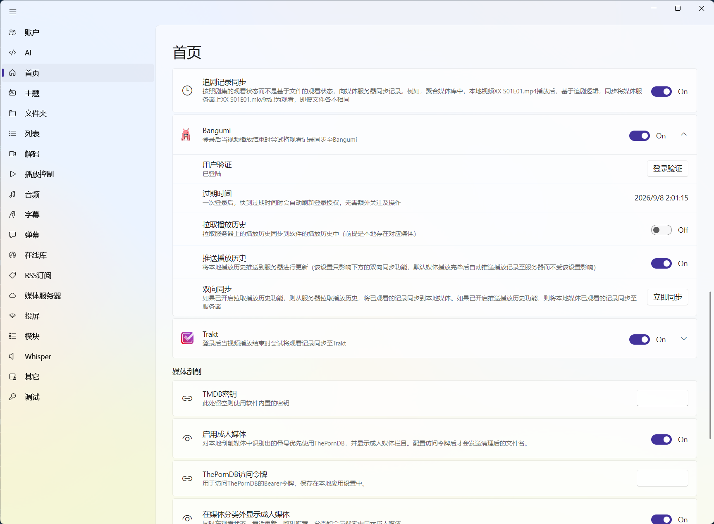

# Bangumi 与 Trakt：把观看记录带到外部账户

Bangumi 和 Trakt 都能记录“看过哪些内容”，但适合的内容和匹配方式不一样。它们同步的是观看记录或已看状态，不是播放器里的精确续播秒数。

## 先选适合自己的服务

| 服务 | 更适合什么 | 匹配重点 |
| --- | --- | --- |
| **Bangumi** | 动漫、电视剧的追番和分集状态 | 作品标题、首播日期、季数和集数 |
| **Trakt** | 电影和电视剧的观影记录 | 本地媒体的 TMDB ID、季数和集数 |

| Bangumi | Trakt |
| --- | --- |
|  |  |

简单说：如果你主要管理番剧和分集进度，优先看 Bangumi；如果电影和剧集都要同步，Trakt 的覆盖范围更合适。zPlayer 对 Bangumi 的同步范围以电视剧/动漫分集为主，电影不要按 Bangumi 电影同步来预期。

## 设置入口在哪里？

打开：`设置 → 首页 → 历史记录`

这里会看到 Bangumi 和 Trakt 各自的设置区域。两者互相独立，可以只登录其中一个，也可以同时使用；第一次配置时建议只启用一个，出了问题更容易判断是哪一环。

图：外部账号同步集中在首页设置的历史记录区域，登录和拉取、推送方向分别控制。

## 页面上的开关分别做什么？

以 Bangumi 为例，Trakt 的操作完全对应：

- **总开关**：允许 zPlayer 使用这个服务。关闭后不会执行该服务的同步。
- **登录验证**：打开浏览器完成授权，再回到 zPlayer。软件会保存授权信息，不需要把账号密码填进 zPlayer。
- **过期时间**：授权接近过期时会自动尝试刷新；如果授权被撤销或刷新失败，再重新登录即可。
- **拉取播放历史**：把外部服务中的已看记录带到 zPlayer；只有本地已经存在并且能匹配上的媒体才会被更新。
- **推送播放历史**：在点击“立即同步”时，把 zPlayer 的观看记录推到外部服务。
- **立即同步**：按当前的拉取/推送开关执行一次手动同步。

::: tip 一个容易忽略的细节
“推送播放历史”开关只控制“立即同步”里的推送方向。平时播放记录保存后，如果服务总开关已打开且登录有效，zPlayer 仍会在后台尝试推送当前观看记录；不需要每次看完一集都手动点击同步。
:::

## 推荐的配置流程

1. 先在[首页管理](/docs/media/home-management)中确认作品标题、年份、季数和集数都正确。
2. 进入 `设置 → 首页 → 历史记录`，打开 Bangumi 或 Trakt 的总开关。
3. 点击“登录验证”，在浏览器中完成授权并返回应用。
4. 第一次测试时只打开一个方向。已有本地记录、想上传到服务时开“推送”；换设备或已有远端记录、想带回本地时开“拉取”。
5. 点击“立即同步”，等待提示完成后，到外部网站和 zPlayer 本地记录各检查一次。

如果打开总开关后马上被关闭，或点击按钮出现授权提示，请按软件当前的授权提示处理，内购说明见[内购解锁](/docs/getting-started/unlock)。

## “立即同步”具体会做什么？

### 只开拉取

软件从远端读取已看记录，尝试匹配本地的电影或剧集，然后更新 zPlayer 的本地观看状态。远端有、本地没有的内容不会凭空出现在首页。

### 只开推送

软件读取本地观看记录，把能匹配到的已看电影或剧集更新到远端。没有正确匹配信息的媒体会被跳过，而不是随便创建一条同名记录。

### 拉取和推送都开

当前流程会先执行拉取，再执行推送。两边记录差异很大时，结果可能和你直觉中的“自动合并”不同；第一次使用不建议直接开启双向同步，先分别测试两个方向更稳妥。

## 自动推送什么时候发生？

当 zPlayer 保存一次播放记录时，通常包括播放结束、主动停止、切换片源或关闭播放器，软件会在后台尝试把当前媒体记录推送到已启用并已登录的 Bangumi/Trakt。网络请求不会阻塞播放器关闭；当时网络不可用时，可以稍后用“立即同步”重试。

这项自动推送是“记录已看状态”的同步，不是把当前播放位置实时写入 Bangumi 或 Trakt。精确的 `00:xx:xx` 续播位置仍然保存在 zPlayer 本地，或按[媒体服务器同步](/docs/sync/media-server)的规则上报给媒体服务器。

## 为什么没有匹配上？

### Bangumi：看标题、日期、季数和集数

Bangumi 会按作品信息和分集信息寻找对应内容。常见问题是：同名作品年份不同、第二季被识别成第一季、目录名不足以判断季数，或者本地只刮削出了一个普通文件而不是电视剧结构。

### Trakt：先看 TMDB ID

Trakt 的电影和剧集匹配主要依赖本地媒体的 TMDB ID。标题看起来一样，不代表两边一定是同一条记录；如果本地没有 TMDB ID、ID 错误，或者刮削到了重制版/特别篇，就可能无法推送或拉取。

遇到匹配问题时，先打开[媒体详情](/docs/media/home/media-detail)，通过[TMDB 与元数据](/docs/media/home/metadata)重新刮削或编辑信息，再进行小范围同步。不要在错误匹配的状态下反复双向同步。

## 两个服务怎么一起用？

可以同时开启，但它们不是互相同步：zPlayer 会分别向 Bangumi 和 Trakt 发送自己的观看记录，也分别读取两边的记录。建议先选一个作为主要记录来源，确认匹配稳定后再开启另一个，避免出现“一边显示看过、另一边还没看过”时不知道该以谁为准。

如果登录信息失效，先重新点击“登录验证”；如果只是某几部作品不同步，优先检查媒体匹配，而不是清空全部本地历史。
