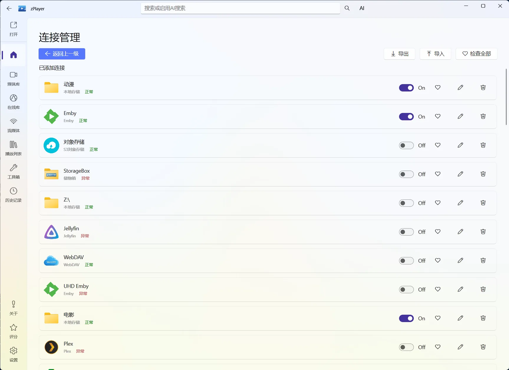
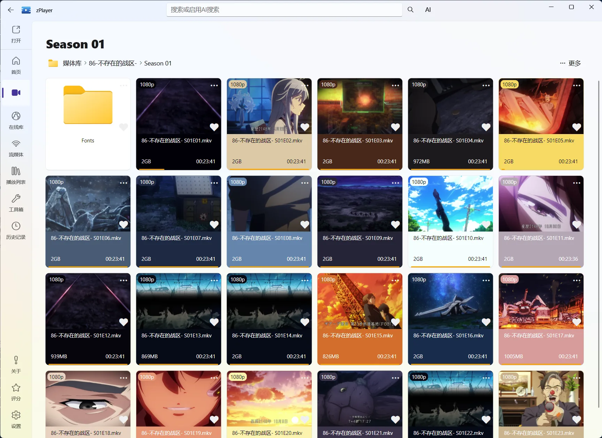
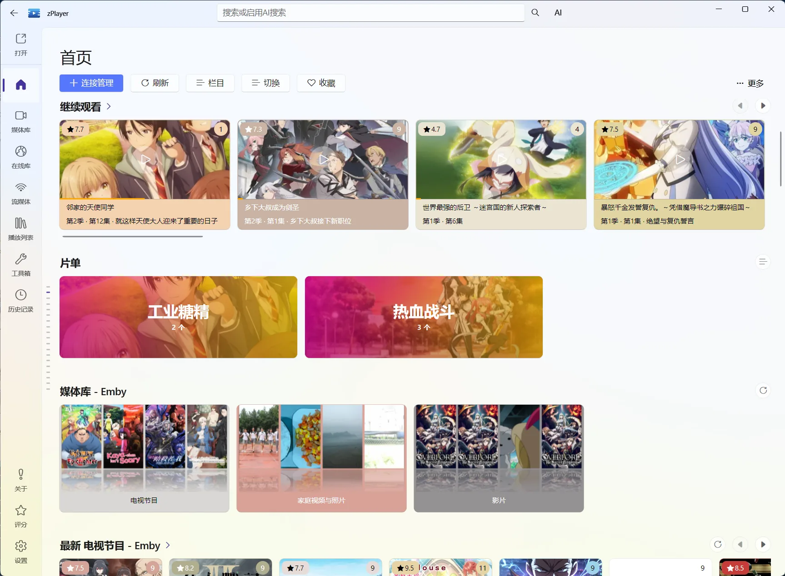
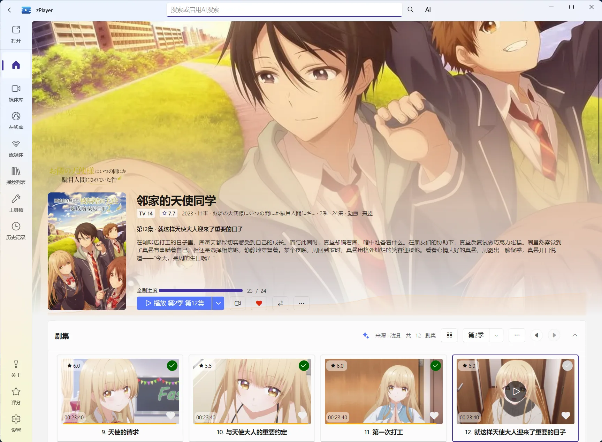
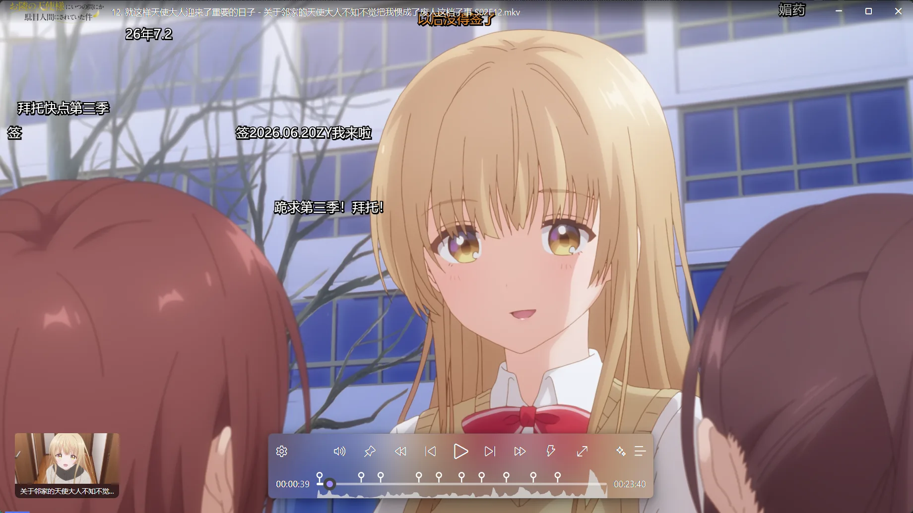
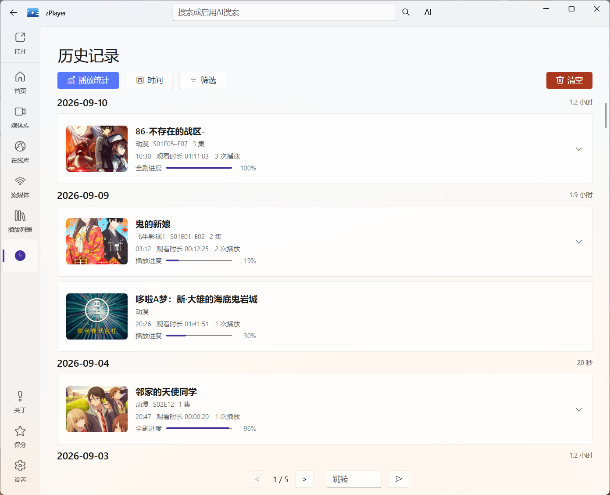

  <section class="zplayer-home-showcase">
    

      
为 Windows 设计的媒体空间

      <h2>找到文件，就能开始播放。</h2>
      
不管你的电影在硬盘、NAS、媒体服务器，还是来自在线站点，zPlayer 都先让你用熟悉的方式打开，再慢慢整理成自己的媒体库。

      

        <a class="zplayer-home-action zplayer-home-action-primary" href="./docs/media/home-management">了解首页管理</a>
        <a class="zplayer-home-action zplayer-home-action-secondary" href="./docs/getting-started/overview">先看看适合哪条路线 →</a>
      

      <ul class="zplayer-home-check-list">
        <li>本地、NAS、网络协议和网盘，都可以按目录直接浏览</li>
        <li>Emby、Jellyfin、Plex、飞牛影视、极影视（Beta）、DLNA 等媒体服务器统一连接</li>
        <li>从文件服务开始，也可以继续整理成刮削首页</li>
      </ul>
    

    

      
    

  </section>

  <section class="zplayer-home-section zplayer-home-connection">
    

      

        
连接管理

        <h2>你的媒体，不必先搬家。</h2>
        
连接管理把分散在电脑、NAS、网盘和媒体服务器里的内容，统一放进 zPlayer。你可以按自己的习惯逐个添加，不需要为了使用播放器先重做文件整理。

        <ul class="zplayer-home-check-list">
          <li>来源保存后，回到首页会自动刷新，不需要手动重新导入</li>
          <li>非媒体服务器按真实内容选择分类，避免电影和电视剧混在一起影响刮削</li>
          <li>媒体服务器可以按需选择直连模式或媒体库模式</li>
        </ul>
        <a class="zplayer-home-inline-link" href="./docs/media/file-services">查看连接管理说明 →</a>
      

      

        
      

    

  </section>

  <section class="zplayer-home-section zplayer-home-file-stage">
    

      

        
先按目录找到它

        <h2>文件在哪儿，就从哪儿开始。</h2>
        
不想刮削时，直接进入来源、文件夹和季目录浏览；想长期管理时，再把同一个来源交给首页整理。文件服务适合先找到内容，也适合一直保持最直观的目录结构。

        <ul class="zplayer-home-check-list">
          <li>按来源、文件夹和季目录浏览，不需要等待完整刮削</li>
          <li>打开本地文件、NAS 或网络服务中的视频即可播放</li>
          <li>目录结构保持不变，后续也能交给首页继续整理</li>
        </ul>
        <a class="zplayer-home-inline-link" href="./docs/media/file-services">查看文件服务 →</a>
      

      

        
      

    

  </section>

  <section class="zplayer-home-section zplayer-home-feature-stage">
    

      
属于你的片单

      <h2>把想看的，放进首页。</h2>
      
把电影、剧集或音乐按主题整理成自己的片单，首页会把它们作为清晰的栏目展示。周末想看、待追剧集或家庭影院片源，不用每次重新搜索。

      <ul class="zplayer-home-check-list">
        <li>按主题整理电影、剧集和音乐</li>
        <li>片单以海报卡片的形式出现在首页</li>
        <li>与收藏、继续观看分开管理，各自有自己的用途</li>
      </ul>
      <a class="zplayer-home-inline-link" href="./docs/media/home/playlists">了解片单怎么用 →</a>
    

    

      
    

  </section>

  <section class="zplayer-home-section zplayer-home-detail-stage">
    

      
    

    

      
媒体详情

      <h2>找到作品，也把它看明白。</h2>
        
首页负责发现，媒体详情负责确认和处理：从匹配结果、季集和片源，到收藏、片单、元数据、章节与剧情内容，都围绕这一部作品展开。启用 AI 分析后，还可以在这里浏览生成的章节、故事剧情和内容结构，并与播放器右侧的内容结构互通。

      <ul class="zplayer-home-check-list">
        <li>重新刮削或从 TMDB 中选择正确的作品</li>
        <li>按季、集、来源和版本选择要播放的内容</li>
        <li>查看章节剧情，管理收藏、片单和观看状态</li>
        <li>查看 AI 识别的章节、故事剧情和内容结构，快速定位关键片段</li>
      </ul>
      <a class="zplayer-home-inline-link" href="./docs/media/home/media-detail">查看媒体详情说明 →</a>
    

  </section>

  <section class="zplayer-home-section zplayer-home-capabilities">
    

      
播放器

      <h2>把播放，调成你喜欢的样子。</h2>
      
真正每天都会用到的，是那些让你少找几次、少改几次、少记几个位置的小功能。

    

    

      

        
从快捷键、手势和高能进度条，到字幕、弹幕、画质滤镜和 AI 内容结构，播放器把真正会影响观看体验的东西放在手边。

        <ul class="zplayer-home-check-list">
          <li>用快捷键、手势和高能进度条快速控制播放</li>
          <li>按需加载字幕、翻译、动画、弹幕、滤镜和着色器</li>
          <li>从章节书签、故事剧情和内容搜索直接跳到关键片段</li>
        </ul>
        <a class="zplayer-home-inline-link" href="./docs/player/">看看播放器能做什么 →</a>
      

      

        
      

    

  </section>

  <section class="zplayer-home-section zplayer-home-history-stage">
    

      
记得你看到哪里

      <h2>历史记录，帮你接着看。</h2>
      
zPlayer 会记住你看过什么、停在什么位置，以及哪些内容还没看完。需要跨服务使用时，还可以把观看状态同步到媒体服务器、Bangumi 或 Trakt。

      <ul class="zplayer-home-check-list">
        <li>继续观看帮你快速回到电影、剧集或具体单集的上次进度</li>
        <li>历史记录、已观看状态和收藏彼此独立，首页栏目可以分别筛选</li>
        <li>播放统计汇总观看时长、活动分布、进度状态和常用数据源</li>
        <li>播放进度可按需同步到媒体服务器，外部账户同步观看记录</li>
      </ul>
      <a class="zplayer-home-inline-link" href="./docs/media/history">查看历史记录与播放统计 →</a>
    

    

      
    

  </section>

  <section class="zplayer-home-section zplayer-home-advantages">
    

      
为什么选择 zPlayer

      <h2>一款播放器，装下整套媒体能力。</h2>
      
从媒体接入、播放控制到 AI 内容理解，把你会用到的能力集中在一个应用里。

    

    

      <article class="zplayer-home-advantage">
        📂
        <h3><a class="zplayer-home-advantage-title" href="./docs/media/file-services">媒体库管理</a></h3>
        
支持本地文件夹、FTP、SFTP、SMB、WebDAV、AList 等多源挂载。

      </article>
      <article class="zplayer-home-advantage">
        ☁️
        <h3><a class="zplayer-home-advantage-title" href="./docs/media/connections/media-servers">同步媒体服务器</a></h3>
        
接入 Emby、Jellyfin、Plex 等媒体服务器，在 Windows 上统一浏览与播放。

      </article>
      <article class="zplayer-home-advantage">
        🌐
        <h3><a class="zplayer-home-advantage-title" href="./docs/media/online-media">在线媒体</a></h3>
        
支持浏览和搜索已配置站点，可按设置优先进入统一详情，也可直接选择线路播放。

      </article>
      <article class="zplayer-home-advantage">
        🏠
        <h3><a class="zplayer-home-advantage-title" href="./docs/media/home-management">首页管理</a></h3>
        
通过扫描与刮削建立可搜索的媒体首页，支持动态栏目、片单与布局调整。

      </article>
      <article class="zplayer-home-advantage">
        🗂️
        <h3><a class="zplayer-home-advantage-title" href="./docs/media/home/media-detail">媒体详情</a></h3>
        
集中处理 TMDB 匹配、季集、片源、收藏、片单、元数据，以及 AI 章节和故事剧情。

      </article>
      <article class="zplayer-home-advantage">
        📡
        <h3><a class="zplayer-home-advantage-title" href="./docs/tools/casting-and-sharing">DLNA 与局域网共享</a></h3>
        
支持投屏播放、媒体渲染与局域网文件共享。

      </article>
      <article class="zplayer-home-advantage">
        🧾
        <h3><a class="zplayer-home-advantage-title" href="./docs/media/history">播放历史</a></h3>
        
按日期找回观看足迹，并统计观看时长、活动分布和常用数据源。

      </article>
      <article class="zplayer-home-advantage">
        🔄
        <h3><a class="zplayer-home-advantage-title" href="./docs/sync/">观看进度同步</a></h3>
        
可将播放进度同步到媒体服务器，并将观看记录同步到 Bangumi 与 Trakt。

      </article>
      <article class="zplayer-home-advantage">
        🎬
        <h3><a class="zplayer-home-advantage-title" href="./docs/player/engine-and-decoder">智能播放引擎</a></h3>
        
兼容多格式音视频，提供高性能解码与硬件加速支持。

      </article>
      <article class="zplayer-home-advantage">
        ⚡
        <h3><a class="zplayer-home-advantage-title" href="./docs/media/home/favorites-and-history#继续观看">快速启动与续播</a></h3>
        
直接打开媒体并自动记忆上次播放进度，回来后可以继续观看。

      </article>
      <article class="zplayer-home-advantage">
        🎞️
        <h3><a class="zplayer-home-advantage-title" href="./docs/player/video-quality">画面预设与滤镜</a></h3>
        
支持 Anime4K、补帧与色彩增强，呈现更出色的视觉体验。

      </article>
      <article class="zplayer-home-advantage">
        🔊
        <h3><a class="zplayer-home-advantage-title" href="./docs/player/audio">音频控制中心</a></h3>
        
EQ 调节、音轨切换、音画同步与音轨提取一应俱全。

      </article>
      <article class="zplayer-home-advantage">
        🖼️
        <h3><a class="zplayer-home-advantage-title" href="./docs/player/subtitles">多字幕系统</a></h3>
        
可同时加载多条字幕轨道并叠加弹幕，支持翻译、动画和样式调整。

      </article>
      <article class="zplayer-home-advantage">
        📖
        <h3><a class="zplayer-home-advantage-title" href="./docs/player/content-modules">书签与笔记系统</a></h3>
        
支持 AI 自动生成、章节时间轴标记、缩略图与概要记录，快速定位精彩片段。

      </article>
      <article class="zplayer-home-advantage">
        💡
        <h3><a class="zplayer-home-advantage-title" href="./docs/settings/ai">AI 智能助手</a></h3>
        
支持媒体摘要生成、问答解析与智能搜索，理解内容更深一层。

      </article>
      <article class="zplayer-home-advantage">
        🪄
        <h3><a class="zplayer-home-advantage-title" href="./docs/settings/ai#视觉模型与多模态">多模态 AI</a></h3>
        
结合文本与视觉识别，实现图像理解与语义分析。

      </article>
      <article class="zplayer-home-advantage">
        🧰
        <h3><a class="zplayer-home-advantage-title" href="./docs/tools/media-toolbox">媒体处理工具箱</a></h3>
        
集成转码、剪辑、字幕、音轨与画面处理等多种实用工具。

      </article>
      <article class="zplayer-home-advantage">
        🧭
        <h3><a class="zplayer-home-advantage-title" href="./docs/tools/media-properties-and-export">文档导出</a></h3>
        
可一键导出视频属性 Markdown，保存影片笔记与解析记录。

      </article>
      <article class="zplayer-home-advantage">
        📡
        <h3><a class="zplayer-home-advantage-title" href="./docs/settings/rss">RSS 订阅中心</a></h3>
        
自动更新番剧订阅，支持离线下载与邮件推送统计。

      </article>
      <article class="zplayer-home-advantage">
        ✨
        <h3><a class="zplayer-home-advantage-title" href="./docs/settings/appearance">Fluent Design 设计</a></h3>
        
以流畅动效与柔和光感，呈现现代美学体验。

      </article>
      <article class="zplayer-home-advantage">
        🔐
        <h3><a class="zplayer-home-advantage-title" href="./docs/tools/storage-box">隐私与加密播放</a></h3>
        
支持登录 PIN，提供加密文件支持与私密空间保护，守护个人媒体安全。

      </article>
    

  </section>

  <section class="zplayer-home-final-cta">
    

      
准备好就开始

      <h2>先打开一部媒体，再慢慢把它变成你的首页。</h2>
      
第一次使用不需要先配置复杂选项，从一部视频或一个文件夹开始，就能逐步找到适合自己的方式。

    

    

      <a class="zplayer-home-action zplayer-home-action-light" href="./docs/">阅读使用文档 →</a>
    

  </section>

  <section class="zplayer-home-feedback">
    

      
需要帮助？

      <h2>遇到问题，直接告诉我。</h2>
      
Bug、功能建议或使用中的疑问，都可以通过邮箱或 GitHub 反馈中心联系开发者。

    

    

      <a href="mailto:panda8833657@live.com">
        邮件联系
        <strong>panda8833657@live.com</strong>
      </a>
      <a href="https://github.com/ZhaoYunxiong/zPlayer-Support" target="_blank" rel="noreferrer">
        GitHub 反馈中心
        <strong>提交 Bug 或功能建议 <b>↗</b></strong>
      </a>
    

  </section>

